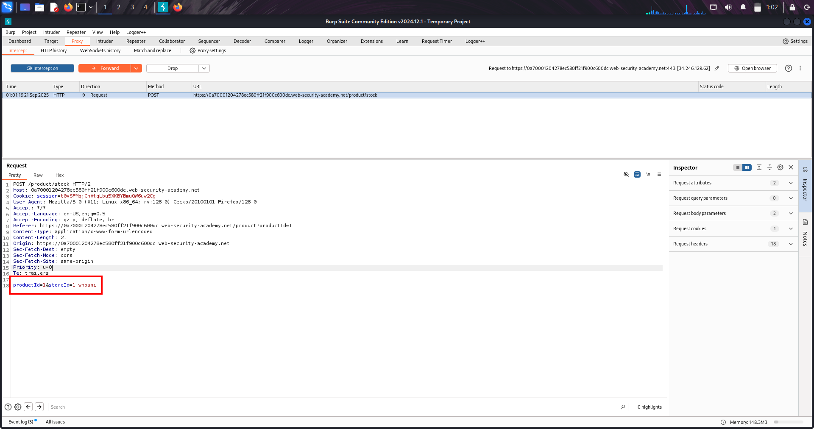
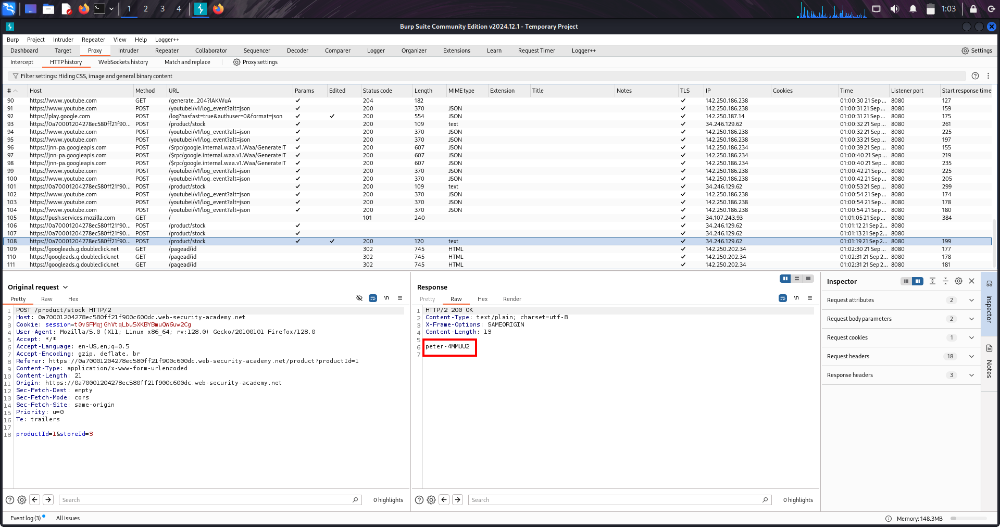

# OS Command Injection — Lab: Shell Injection (whoami)

---

## 🔹 Overview
This lab demonstrates an *OS command injection* where user input is passed into a shell command.  
Goal: inject whoami via a parameter (e.g. storeId) and read the command output.

---

## 🔹 Methodology / Lab Walkthrough

1. *Capture*  
   - Intercept the normal POST /product/stock request (Burp Proxy ON).

2. *Inject*  
   - Send to Repeater and modify the parameter (e.g., storeId):  
     
     storeId=1| whoami
     
   - Forward the modified request.

   

3. *Observe*  
   - Inspect the response body for the whoami output (use markers if needed).  
   - Copy the username returned.

   

4. *Submit*  
   - Submit the captured username to solve the lab.

---

## 🔹 Security Impact
- Remote command execution → immediate server compromise, data theft, pivoting.

---

## 🔹 Remediation (short)
- Never pass unsanitized input to a shell.  
- Use native APIs or safe exec calls (no shell interpolation).  
- Whitelist inputs (e.g., numeric IDs only) and validate server-side.

---

## 🔹 Pentest checklist
- [x] Capture the vulnerable request.  
- [x] Inject separator + command (e.g., | whoami) and forward.  
- [x] Verify output in response and extract username.  
- [x] Report with PoC screenshots and remediation.

---
