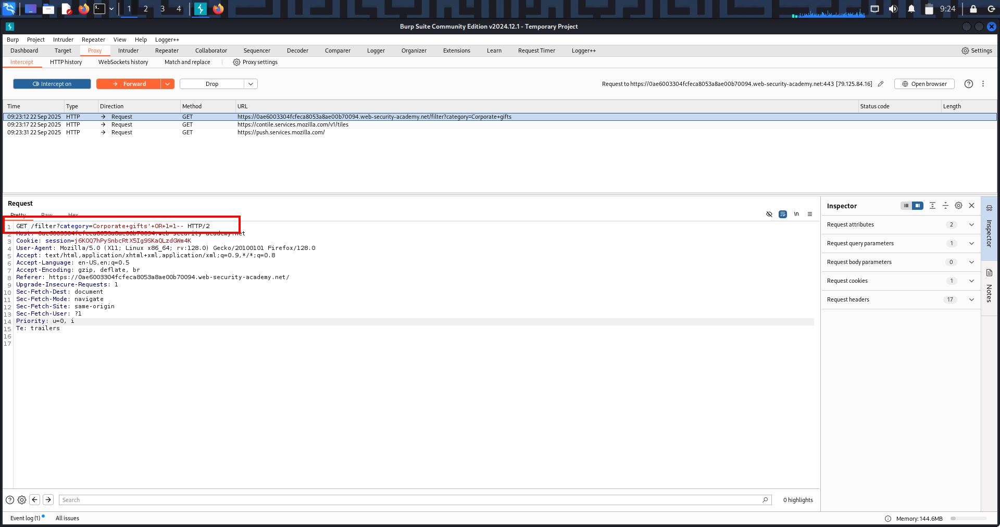

# SQL Injection — Lab 1: Retrieving Hidden Data

---

## 🔹 One-line summary
Injected SQL via the category parameter to bypass released = 1 and display unreleased products (proof attached).

---

## 🔹 Overview
SQL Injection (SQLi) lets attackers manipulate database queries by injecting crafted input.  
In this lab the category filter is concatenated into SQL; by altering the parameter we force the WHERE clause to return unreleased products.

---

## 🔹 Methodology

- Capture the category filter request (e.g. GET /filter?category=...) in Burp Proxy.  
- Send to Repeater and modify the category value to comment out or bypass the released = 1 check:CorporateGifts'-- // or CorporateGifts' OR 1=1--
- Forward the modified request and inspect the response for unreleased products.

---

## 🔹 Proof (evidence)

  
(Screenshot 1: modified request showing payload CorporateGifts' OR 1=1-- in the URL/params.)

  
(Screenshot 2: page showing unreleased products / PoC that the injection returned additional items.)

---

## 🔹 Impact
- Data disclosure: hidden/unreleased product data exposed.  
- Potential escalation: with additional queries an attacker can read sensitive tables, extract credentials, or modify data.

---

## 🔹 Remediation (short)
- Use *parameterized queries / prepared statements* (no string concatenation into SQL).  
- Whitelist allowed category values (e.g., only allow known categories).  
- Apply least privilege to DB user accounts and monitor for anomalous query patterns.

---

# SQL Injection — Lab 2: Login Bypass / Subverting App Logic

---

## 🔹 One-line summary
Bypass the login check by injecting a SQL comment/boolean into the username parameter (e.g. administrator'--) and gain access to the admin account.  

---

## 🔹 Overview
A vulnerable login/account lookup concatenates user input into SQL. Injecting a comment or always-true boolean removes or bypasses the AND password = '...' check, letting the DB return the administrator row without the correct password.

---

## 🔹 Methodology (lab walk-through)
- Capture the login flow and find the request that looks up the account (POST /login or subsequent GET /my-account?username=...).  
- Force the account GET to appear by submitting a POST with username=administrator (no payload) and forward it.  
- Modify the resulting GET (or the original POST if applicable) to inject:administrator'-- // or administrator' OR '1'='1'--
[6:19 am, 23/09/2025] ‌‌: - Send the modified GET and inspect the response for admin content (dashboard / admin UI).

---

## 🔹 Proof
  
(Screenshot: the modified GET /my-account?username=administrator'-- captured in Burp/Repeater — shows the payload used to bypass authentication.)

---

## 🔹 Impact
- Immediate account takeover (often admin) → full application access.  
- Data exposure, modification, and potential escalation to backend compromise.

---

## 🔹 Remediation (short)
- Use *parameterized queries / prepared statements* for all DB access (never concatenate inputs).  
- Do not rely on client-side or URL parameters to authorize access to sensitive account pages.  
- Enforce server-side session ownership checks for account pages.

---

## 🔹 Pentest checklist
- [x] Capture login/account lookup requests.  
- [x] Test ', OR 1=1--, and comment variations in username.  
- [x] Verify admin UI or privileged content appears.  
- [x] Save raw request/response and include one strong screenshot (manipulated request).

---
