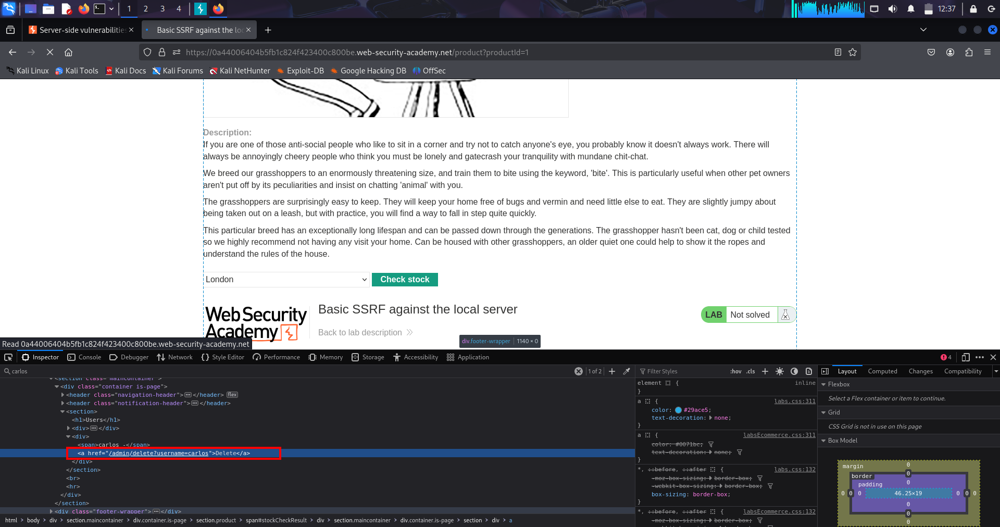
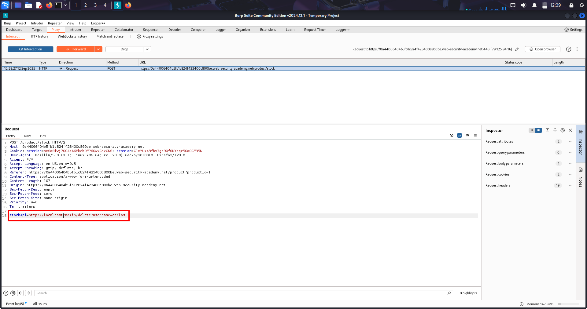
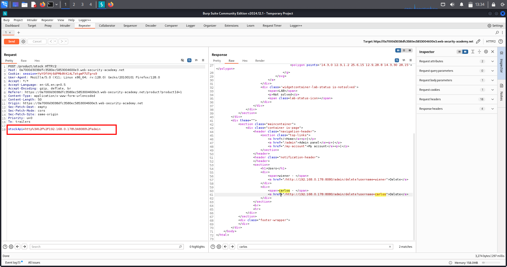
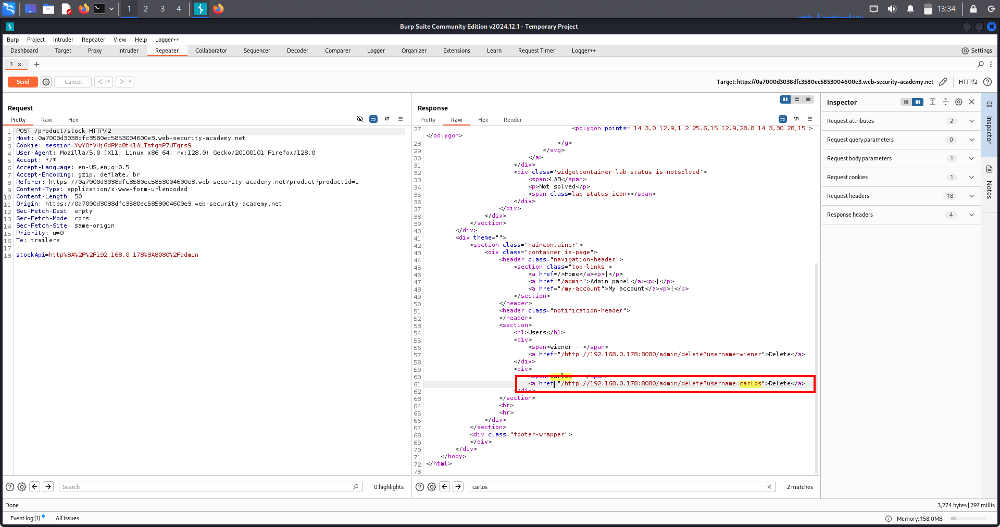

# SSRF — Server-Side Request Forgery

---

## 🔹 Overview
Server-Side Request Forgery (SSRF) occurs when an application fetches remote URLs supplied by an attacker.  
This allows attackers to make the server reach internal-only systems (localhost, internal IPs) or other services, potentially exposing sensitive data or triggering privileged actions.

---

## 🔹 Why this is dangerous
- Attackers can reach internal admin pages (localhost / 127.0.0.1) that are normally inaccessible from the outside.  
- The server’s trust in its own network can be abused to read data or perform actions (delete users, access metadata services, etc.).

---

## 🔹 Lab Description
The application exposes a stockApi parameter which the server fetches. By changing stockApi to http://localhost/admin, the server will request the admin page and return its HTML. From that response we can find a delete link (/delete?username=carlos) and then use SSRF again to trigger it.

---

## 🔹 Methodology / Steps

1. *Identify SSRF input*  
   - Intercept the request that contains stockApi (e.g., POST /product/stock).

2. *Trigger internal request*  
   - Modify stockApi to http://localhost/admin and send the request so the server fetches its own admin page.

     
   (Screenshot: modified stockApi → server fetched admin HTML showing admin links.)

3. *Find action URL*  
   - Inspect the returned HTML (Raw / Elements) and locate the delete link: /delete?username=carlos.

4. *Exploit via SSRF*  
   - Set stockApi to the discovered delete URL (e.g., http://localhost/delete?username=carlos) and send the request again.  
   - Server performs the delete action as it trusts local requests.

     
   (Screenshot: second SSRF showing delete request/response and confirmation that carlos was removed.)

5. *Verify*  
   - Confirm carlos no longer exists (site shows deletion or lab solved).

---

## 🔹 Security Impact
- Remote attackers can cause the server to access local-only services, potentially leading to data exfiltration, internal port scanning, or destructive actions (delete/modify resources).
- SSRF can be combined with other weaknesses for severe impact (e.g., metadata service access in cloud environments).

---

## 🔹 Remediation
- Implement an allowlist of allowed outbound hosts (only trusted domains).  
- Block requests to internal/private IP ranges (127.0.0.0/8, 10.0.0.0/8, 172.16.0.0/12, 192.168.0.0/16, 169.254.0.0/16).  
- Use an outbound proxy that validates/filters requested URLs.  
- Avoid directly requesting user-supplied URLs; validate and normalize inputs and disallow protocols like file:, gopher:, etc.

---

# SSRF Lab-2 — Attacking Back-end Systems (Internal targets)

---

## 🔹 Overview
This note covers SSRF attacks targeting internal back-end systems (private IPs / non-routable hosts).  
SSRF allows an attacker to make the *server* fetch internal admin pages and APIs (e.g., http://192.168.0.68/admin) so they can view or trigger sensitive actions that are normally protected by network isolation.

> Only test these techniques on authorized labs/systems.

---

## 🔹 Short summary
SSRF makes the server (not your browser) fetch internal admin pages and APIs so you can view or trigger admin-only actions.

---

## 🔹 Why internal back-end systems are high value
- Internal services often assume local requests are trusted and skip strong auth.  
- Common targets: admin consoles, cloud metadata endpoints, DB HTTP APIs, container APIs, health/actuator endpoints.  
- Successful SSRF → credential theft, config changes, DB dumps, destructive admin actions.

---

## 🔹 Lab description (example)
The app has a stock-check feature (POST /product/stock) that accepts a stockApi URL the server will fetch.  
*Goal:* Use SSRF to fetch http://192.168.0.68/admin, find a delete link for user carlos, then invoke it via SSRF to remove the user.

---

## 🔹 High-level attack flow
1. Intercept POST /product/stock and find stockApi.  
2. Replace stockApi with internal admin URL.  
3. Inspect returned HTML and extract actionable endpoints.  
4. Put the action URL back into stockApi and send again to trigger the action.  
5. Verify the change and collect PoC.

---

## 🔹 Exact step-by-step (lab-ready)

1. *Capture the stock-check request*  
   - Intercept the request in Burp Proxy / Repeater.  
   - Example body:stockApi=http://stock.example.net:8080/product/stock/check?productId=1
2. *Confirm encoding*  
- If captured value is percent-encoded (%3A, %2F) use encoded payloads; otherwise use plain.

3. *Recon: fetch internal admin page*  
- Replace stockApi with the internal admin page:
  - Plain: stockApi=http://192.168.0.68/admin
  - Encoded: stockApi=http%3A%2F%2F192.168.0.68%2Fadmin
- Send the request and inspect the returned HTML (Raw / Elements).

  
(Screenshot 1: server fetched internal admin HTML after stockApi was set to the admin URL.)

4. *Inspect returned HTML / Elements*  
- Search for delete, username=, action=, hidden tokens, JS-generated links.  
- Copy the actionable URL (example):http://192.168.0.68:8080/admin/delete?username=carlos
  
(Screenshot 2: HTML/Elements view showing the /delete?username=carlos link.)

5. *Exploit: trigger the action via SSRF*  
- Put the full actionable URL back into stockApi (encoded if original was encoded):
  - Plain: stockApi=http://192.168.0.68:8080/admin/delete?username=carlos
  - Encoded: stockApi=http%3A%2F%2F192.168.0.68%3A8080%2Fadmin%2Fdelete%3Fusername%3Dcarlos
- Send the request — the server will perform the delete.

  
(Screenshot 3: final SSRF request/response showing the delete action executed and confirmation.)

6. *Verify & collect evidence*  
- Fetch an admin users page via stockApi to confirm removal and save raw requests/responses and timestamps as PoC.

---

## 🔹 Example payloads (copy/paste)

*Plain*
stockApi=http://192.168.0.68/admin
stockApi=http://192.168.0.68:8080/admin/delete?username=carlos
*Encoded*
stockApi=http%3A%2F%2F192.168.0.68%2Fadmin 
stockApi=http%3A%2F%2F192.168.0.68%3A8080%2Fadmin%2Fdelete%3Fusername%3Dcarlos
---

## 🔹 Real-world chaining & impact
- SSRF → cloud metadata (169.254.169.254) → credential theft.  
- SSRF → internal DB APIs → data exfiltration.  
- SSRF → create admin user / change config → full takeover.

---

## 🔹 Defenses & reporting
- Use allow-lists for outbound hosts and block internal ranges (127/8, 10/8, 169.254.169.254, ::1, 192.168/16).  
- Canonicalize & validate user-supplied URLs.  
- Use an egress proxy that filters outgoing requests.  
- Enforce authentication/authorization even for local requests and log outbound requests.

---

