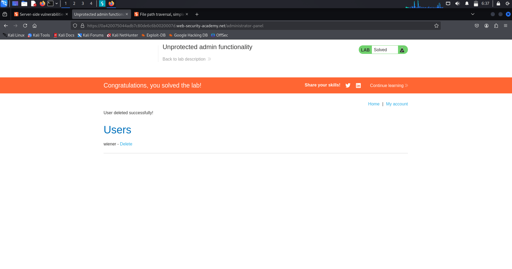

# Access Control – Lab 1: Unprotected Admin Functionality

---

## 🔹 Overview
This lab highlights a *broken access control* vulnerability where an administrative function was exposed without any authorization checks. Instead of enforcing proper access control, the application simply hid the sensitive endpoint.

---

## 🔹 Methodology

1. *Reconnaissance*
   - Inspected /robots.txt file.
   - Found a disallowed path: /administrator-panel.

2. *Exploitation*
   - Navigated directly to /administrator-panel.
   - Successfully accessed the admin interface without being an administrator.

3. *Privilege Escalation*
   - Executed an administrative action: deleted the user carlos.  
   - This confirmed the lack of authorization controls.

---

## 🔹 Proof of Exploit

(Screenshot shows successful access to the admin panel and deletion of the carlos account.)

---

## 🔹 Security Impact
- Unauthorized users could access administrative functionality.  
- Potential consequences:
  - Mass deletion of accounts.  
  - Data manipulation.  
  - Full system takeover.  

---

## 🔹 Remediation
- Enforce *server-side role-based access control (RBAC)*.  
- Never expose sensitive endpoints in robots.txt.  
- Implement authorization middleware to validate user roles.  
- Monitor and log access attempts to restricted areas.  

---
