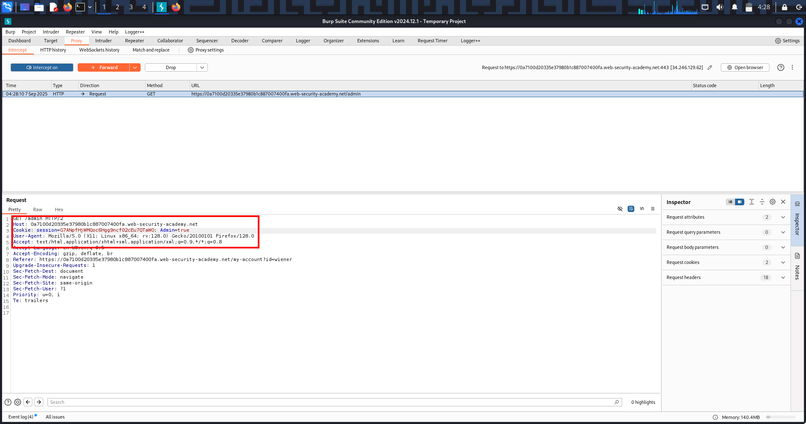

# Access Control – Lab 1: Unprotected Admin Functionality

---

## 🔹 Overview
This lab highlights a *broken access control* vulnerability where an administrative function was exposed without any authorization checks. Instead of enforcing proper access control, the application simply hid the sensitive endpoint.

---

## 🔹 Methodology

1. *Reconnaissance*
   - Inspected /robots.txt file.
   - Found a disallowed path: /administrator-panel.

2. *Exploitation*
   - Navigated directly to /administrator-panel.
   - Successfully accessed the admin interface without being an administrator.

3. *Privilege Escalation*
   - Executed an administrative action: deleted the user carlos.  
   - This confirmed the lack of authorization controls.

---

## 🔹 Proof of Exploit

(Screenshot shows successful access to the admin panel and deletion of the carlos account.)

---

## 🔹 Security Impact
- Unauthorized users could access administrative functionality.  
- Potential consequences:
  - Mass deletion of accounts.  
  - Data manipulation.  
  - Full system takeover.  

---

## 🔹 Remediation
- Enforce *server-side role-based access control (RBAC)*.  
- Never expose sensitive endpoints in robots.txt.  
- Implement authorization middleware to validate user roles.  
- Monitor and log access attempts to restricted areas.  

---

# Access Control – Lab 2: Unprotected Admin Functionality (via HTML Source)

---

## 🔹 Overview
This lab demonstrates a *broken access control* vulnerability where an administrative panel was hidden in the HTML source code but not protected with any authentication or authorization mechanism.

---

## 🔹 Methodology

1. *Reconnaissance*
   - Viewed the page source (Ctrl+U).
   - Found a hidden link pointing to /administrator-panel.

2. *Exploitation*
   - Accessed the hidden URL directly in the browser.
   - The admin panel loaded without requiring admin credentials.

3. *Privilege Escalation*
   - Deleted the user carlos via the exposed admin functionality.  
   - This confirmed that the application lacked proper access control.

---

## 🔹 Proof of Exploit
  
(Screenshot showing hidden admin link in HTML source)  

  
(Screenshot showing successful deletion of carlos account and lab completion)  

---

## 🔹 Security Impact
- Unauthorized users could access administrative interfaces.  
- Potential consequences include:
  - Account deletions or modifications.  
  - Full takeover of user data and application functionality.  
  - Compromise of business-critical operations.  

---

## 🔹 Remediation
- Enforce *server-side authentication and authorization checks*.  
- Do not rely on obscurity (hiding links in HTML or JS).  
- Restrict access to admin routes via RBAC, strong authentication, and network controls.  
- Regularly review source code and remove hardcoded sensitive URLs.  

---

# Access Control – Lab 3: Parameter-Based Access Control

---

## 🔹 Overview
This lab demonstrates an insecure access control mechanism where user roles are determined by *parameters* (such as query strings, cookies, or hidden fields) that are directly modifiable by the client.  
By tampering with these parameters, an attacker can escalate privileges and gain administrative access.

---

## 🔹 Methodology

1. *Normal Login*
   - Logged in as a regular user.  
   - Observed a parameter in the request: admin=false.

2. *Tampering the Parameter*
   - Captured the request in Burp Suite Proxy while accessing the *Admin Panel*.  
   - Modified the parameter from admin=false → admin=true.  
   - Successfully accessed the *admin interface*.

3. *Exploitation*
   - Performed an administrative action: deleted the user carlos.  
   - Lab solved ✅

---

## 🔹 Proof of Exploit

---

## 🔹 Security Impact
- Any user can escalate privileges by altering request parameters.  
- Potential consequences:
  - Full admin account takeover.  
  - Ability to delete or modify user data.  
  - Compromise of the entire application.

---

## 🔹 Remediation
- Never store authorization or role information in user-controllable parameters.  
- Implement *server-side role-based access control (RBAC)*.  
- Validate user roles on every sensitive action.  
- Use secure session handling instead of hidden fields or query strings.

---

# Access Control – Lab 4: Horizontal Privilege Escalation (IDOR with GUIDs)

---

## 🔹 Overview
This lab demonstrates an *Insecure Direct Object Reference (IDOR)* / horizontal privilege escalation where a normal user can access another user’s data by substituting identifiers (GUIDs) in requests. Even seemingly random GUIDs can be discovered elsewhere in the app (profiles, comments, links), allowing attackers to view or act on other users’ accounts.

---

## 🔹 Methodology

1. *Reconnaissance*
   - Logged in as wiener:peter.  
   - Navigated to *My Account* and observed an account request containing my GUID (id=<my_GUID>).

2. *Discovery of Target GUID*
   - Browsed public pages (e.g., blog posts, comments) and found *Carlos’ GUID* exposed in a link or request.

3. *Tampering the Request*
   - Captured the /my-account?id=<my_GUID> request in Burp Proxy.  
   - Replaced my GUID with Carlos’ GUID and resent the request.

4. *Exploitation*
   - The server returned Carlos’ account page data (API key, profile).  
   - Submitted Carlos’ API key to the lab to complete the challenge.  
   - Lab solved ✅

---

## 🔹 Proof of Exploit
  
(Screenshot showing Carlos’ account page / API key returned after substituting GUID.)

---

## 🔹 Security Impact
- Attackers can *read sensitive user data* (API keys, emails, personal info).  
- Attackers can *modify or delete other users' data* if write actions are exposed.  
- Compromise ranges from privacy breach to full account takeover and downstream escalation (API abuse, pivoting).

---

## 🔹 Remediation
- Enforce *server-side object-level authorization*: always verify resource.owner == session.user.  
- Do not trust client-supplied IDs for authorization decisions.  
- Avoid exposing internal identifiers where possible; if required, validate ownership on every access.  
- Implement logging/alerts for suspicious cross-user access patterns.

---
