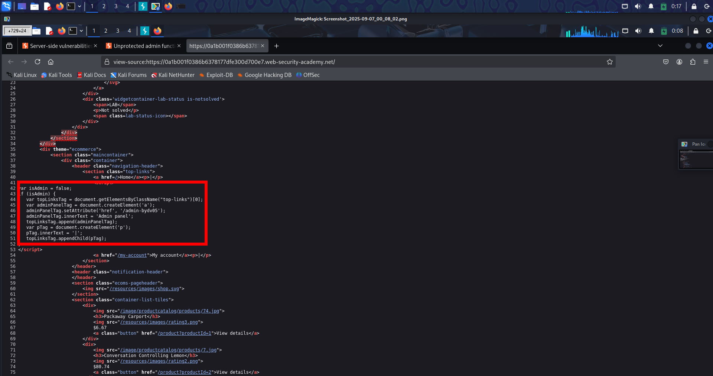
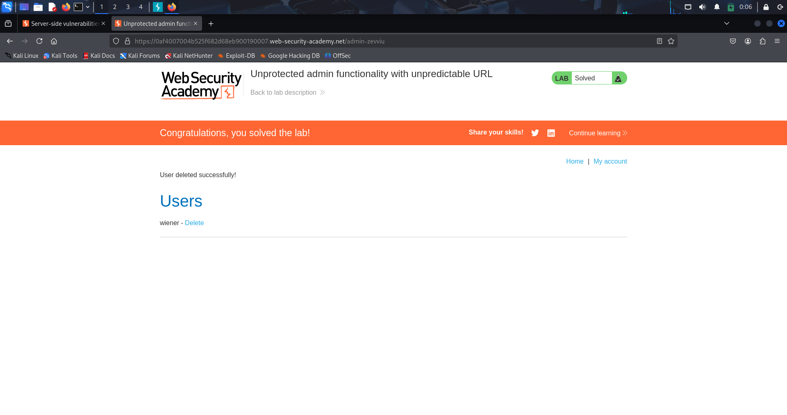
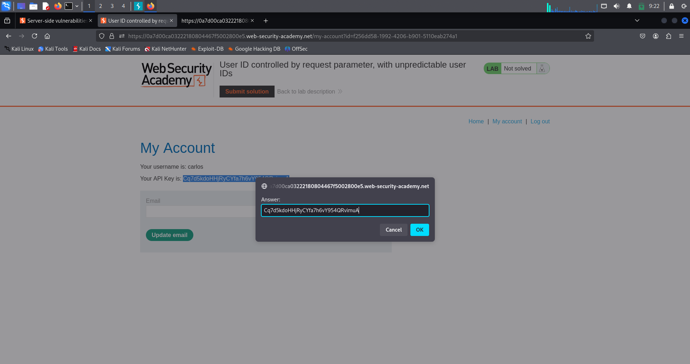
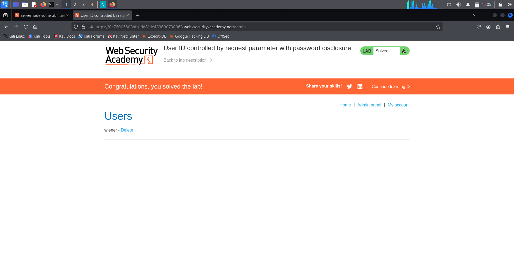

# Lab-1 🔐 Broken Access Control — Unprotected Functionality

---

## 🔹 Overview

Broken access control occurs when an application fails to correctly enforce *who is allowed to access what*.

In this case, a *sensitive admin function exists but is completely unprotected*, meaning any user can access it directly by visiting the URL.

This is a *high-impact, **real-world* vulnerability commonly found in production applications — not just labs.

---

## 🔹 What Is This Topic?

This topic focuses on *vertical access control failures*, where:

- A low-privileged user  
- Gains access to high-privileged (admin) functionality  
- Because the server *does not verify authorization*

### Key point:

> *Hiding functionality in the UI is NOT access control.*

Access control *must be enforced server-side*, not assumed.

---

## 🔹 Lab Walkthrough (Step-by-Step)

### 1️⃣ Login as a normal user

Username: wiener Password: peter

---

### 2️⃣ Observe application behavior

- No admin panel link visible in UI  
- Interface appears restricted  

Next, manually check:

/robots.txt

---

### 3️⃣ Information disclosure via robots.txt

The file reveals a hidden path:

Disallow: /administrator-panel

This indicates the existence of an admin endpoint that developers attempted to hide.

---

### 4️⃣ Manual endpoint access

Manually browse to:

/administrator-panel

---

### 5️⃣ Authorization failure confirmed

- Admin panel loads successfully  
- HTTP response status: *200 OK*  
- No authentication or role verification performed  

➡ *Unprotected admin functionality confirmed*

---

### 6️⃣ Abuse admin functionality

- Locate delete-user feature  
- Delete the user:

carlos

---

### 7️⃣ Lab solved ✅

---

## 🔹 Evidence

### 📸 robots.txt Disclosure


---

### 📸 Direct Access to /administrator-panel (HTTP 200)


---

## 🔹 Real-World Scenarios (Comprehensive)

### 🧩 Scenario 1: Hidden Admin Panels (Most Common)

*Developer assumption*  
Only admins know the URL

*Attacker action*  
Manually visits /admin

*Result*  
Full admin access

---

### 🧩 Scenario 2: Frontend-Only Restrictions

*Expected*  
Buttons hidden via JavaScript

*Attacker*  
Calls backend API directly

*Result*  
Unauthorized admin actions

---

### 🧩 Scenario 3: robots.txt Disclosure

*Expected*  
Sensitive paths hidden from bots

*Attacker*  
Reads /robots.txt

*Result*  
Admin endpoints exposed

---

### 🧩 Scenario 4: Guessable URLs

Common targets:

/admin /administrator /manage /control /dashboard /backend

*Result*  
Admin functionality exposed

---

### 🧩 Scenario 5: Mobile / API Admin Endpoints

*Attacker*  
Inspects API traffic

*Result*  
Direct admin API access

---

### 🧩 Scenario 6: Legacy / Forgotten Endpoints

Examples:

/admin_old /admin_backup /v1/admin

*Result*  
Legacy admin access

---

## 🔹 High-Value Endpoints to Always Test

### 🔥 Admin Panels
```
/admin 
/administrator 
/manage 
/control 
/backend 
/dashboard
```

### 🔥 APIs
```
/api/admin 
/api/users 
/api/roles 
/api/deleteUser
```

### 🔥 Hidden / Info Files
```
/robots.txt 
/.git/ 
/.env 
/config
```

---

## 🔹 Multi-Chain Attacks (Real Impact)

### 🔗 Chain 1: Access Control → Account Takeover

Admin panel access  
→ Reset passwords  
→ Full account takeover

---

### 🔗 Chain 2: Access Control → Data Breach

Admin access  
→ Export users  
→ Sensitive data leak

---

### 🔗 Chain 3: Access Control → RCE

Admin access  
→ File upload / config change  
→ Remote code execution

---

## 🔹 Remediation (Defensive View)

### ✅ Proper Fixes

- Enforce server-side authorization
- Verify role on *every request*
- Implement RBAC / ABAC
- Protect admin routes with middleware
- Log unauthorized access attempts

---

### ❌ What Never Works

- ❌ Hiding links in UI
- ❌ Assuming users won’t guess URLs
- ❌ Client-side role checks

---

## 🔹 Extra Notes / Tips (Attacker Mindset)

- Always test direct URL access
- UI ≠ Security
- If login exists → access control bugs likely exist
- Admin panels are high-value targets
- Easy to find, high impact, bounty-friendly

---

## 🧠 One-Line Memory Hook

> *If the server doesn’t check your role, you decide your role.*


---

# Access Control – Lab 2: Unprotected Admin Functionality (via HTML Source)

---

## 🔹 Overview
This lab demonstrates a *broken access control* vulnerability where an administrative panel was hidden in the HTML source code but not protected with any authentication or authorization mechanism.

---

## 🔹 Methodology

1. *Reconnaissance*
   - Viewed the page source (Ctrl+U).
   - Found a hidden link pointing to /administrator-panel.

2. *Exploitation*
   - Accessed the hidden URL directly in the browser.
   - The admin panel loaded without requiring admin credentials.

3. *Privilege Escalation*
   - Deleted the user carlos via the exposed admin functionality.  
   - This confirmed that the application lacked proper access control.

---

## 🔹 Proof of Exploit
  
(Screenshot showing hidden admin link in HTML source)  

  
(Screenshot showing successful deletion of carlos account and lab completion)  

---

## 🔹 Security Impact
- Unauthorized users could access administrative interfaces.  
- Potential consequences include:
  - Account deletions or modifications.  
  - Full takeover of user data and application functionality.  
  - Compromise of business-critical operations.  

---

## 🔹 Remediation
- Enforce *server-side authentication and authorization checks*.  
- Do not rely on obscurity (hiding links in HTML or JS).  
- Restrict access to admin routes via RBAC, strong authentication, and network controls.  
- Regularly review source code and remove hardcoded sensitive URLs.  

---

# Access Control – Lab 3: Parameter-Based Access Control

---

## 🔹 Overview
This lab demonstrates an insecure access control mechanism where user roles are determined by *parameters* (such as query strings, cookies, or hidden fields) that are directly modifiable by the client.  
By tampering with these parameters, an attacker can escalate privileges and gain administrative access.

---

## 🔹 Methodology

1. *Normal Login*
   - Logged in as a regular user.  
   - Observed a parameter in the request: admin=false.

2. *Tampering the Parameter*
   - Captured the request in Burp Suite Proxy while accessing the *Admin Panel*.  
   - Modified the parameter from admin=false → admin=true.  
   - Successfully accessed the *admin interface*.

3. *Exploitation*
   - Performed an administrative action: deleted the user carlos.  
   - Lab solved ✅

---

## 🔹 Proof of Exploit


---

## 🔹 Security Impact
- Any user can escalate privileges by altering request parameters.  
- Potential consequences:
  - Full admin account takeover.  
  - Ability to delete or modify user data.  
  - Compromise of the entire application.

---

## 🔹 Remediation
- Never store authorization or role information in user-controllable parameters.  
- Implement *server-side role-based access control (RBAC)*.  
- Validate user roles on every sensitive action.  
- Use secure session handling instead of hidden fields or query strings.

---

# Access Control – Lab 4: Horizontal Privilege Escalation (IDOR with GUIDs)

---

## 🔹 Overview
This lab demonstrates an *Insecure Direct Object Reference (IDOR)* / horizontal privilege escalation where a normal user can access another user’s data by substituting identifiers (GUIDs) in requests. Even seemingly random GUIDs can be discovered elsewhere in the app (profiles, comments, links), allowing attackers to view or act on other users’ accounts.

---

## 🔹 Methodology

1. *Reconnaissance*
   - Logged in as wiener:peter.  
   - Navigated to *My Account* and observed an account request containing my GUID (id=<my_GUID>).

2. *Discovery of Target GUID*
   - Browsed public pages (e.g., blog posts, comments) and found *Carlos’ GUID* exposed in a link or request.

3. *Tampering the Request*
   - Captured the /my-account?id=<my_GUID> request in Burp Proxy.  
   - Replaced my GUID with Carlos’ GUID and resent the request.

4. *Exploitation*
   - The server returned Carlos’ account page data (API key, profile).  
   - Submitted Carlos’ API key to the lab to complete the challenge.  
   - Lab solved ✅

---

## 🔹 Proof of Exploit
  
(Screenshot showing Carlos’ account page / API key returned after substituting GUID.)

---

## 🔹 Security Impact
- Attackers can *read sensitive user data* (API keys, emails, personal info).  
- Attackers can *modify or delete other users' data* if write actions are exposed.  
- Compromise ranges from privacy breach to full account takeover and downstream escalation (API abuse, pivoting).

---

## 🔹 Remediation
- Enforce *server-side object-level authorization*: always verify resource.owner == session.user.  
- Do not trust client-supplied IDs for authorization decisions.  
- Avoid exposing internal identifiers where possible; if required, validate ownership on every access.  
- Implement logging/alerts for suspicious cross-user access patterns.

---

# Access Control – Lab 5: Horizontal → Vertical Privilege Escalation

---

## 🔹 Overview
This lab demonstrates how a *horizontal privilege escalation (IDOR)* can be chained into a *vertical escalation* by exposing admin credentials or sensitive fields.  
An attacker who can view another user’s page (via IDOR) may find admin-only data (e.g., a prefixed/hidden password) and then log in as the administrator to gain full control.

---

## 🔹 Vulnerability
The application identifies resources using a client-controllable parameter, for example:/my-account?id=wiener
By substituting another user’s identifier (e.g., id=administrator), the application returns that user’s page. If that page contains *sensitive data* (hidden fields, prefilled passwords, tokens), an attacker can extract those values and *assume the higher-privilege identity*.

---

## 🔹 Methodology / Lab Walkthrough

1. *Initial Access (Recon)*  
   - Logged in as a normal user: wiener / peter.  
   - Navigated to *My Account* and observed the account request:  
     
     GET /my-account?id=wiener
     

2. *Horizontal IDOR*  
   - Captured the request in Burp Suite Proxy and replaced the id parameter with administrator:  
     
     GET /my-account?id=administrator
     
   - The server returned the administrator’s account page.

3. *Discovery of Sensitive Data*  
   - Inspected the returned HTML source and found the admin password present in a hidden/prefilled field.

4. *Vertical Escalation (Account Takeover)*  
   - Copied the administrator password from the source.  
   - Logged out and re-authenticated as:  
     
     Username: administrator
     Password: <retrieved-password>
     
   - Successfully logged in as the administrator.

5. *Impactful Action (Proof of Compromise)*  
   - Accessed the Admin Panel and performed an administrative action: *deleted user carlos*.  
   - Lab solved ✅

---

## 🔹 Proof of Exploit
  
(Screenshot showing the admin page HTML source with the prefilled/hidden password field.)

  
(Screenshot showing successful admin login and deletion of carlos.)

---

## 🔹 Security Impact
- Exposing sensitive fields (passwords, tokens) in user-accessible pages allows attackers to *escalate privileges* from normal users to administrators.  
- Consequences include complete application compromise, data loss, and unauthorized destructive actions.

---

## 🔹 Remediation
- *Never* expose secrets in HTML (hidden fields, prefilled inputs, client-side JS).  
- Enforce *server-side authorization* for every resource and action: resource.owner == session.user.  
- Remove any sensitive values from client responses. Issue secrets only through secure, server-controlled channels.  
- Monitor and log suspicious cross-account access attempts.

---
