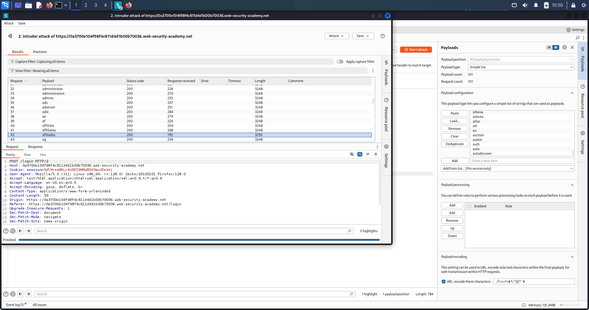

# Authentication Vulnerabilities – Username Enumeration & Password Brute-Force

---

## 🔹 Overview
Authentication vulnerabilities allow attackers to bypass login controls, impersonate users, and gain access to sensitive functionality.  
This write-up focuses on *username enumeration* and *password brute-force* — a common attacker workflow: enumerate valid usernames first, then brute-force passwords for those accounts.

---

## 🔹 Why this is dangerous
- Successful authentication bypass leads to account takeover, data theft, and privilege escalation.  
- Username enumeration drastically reduces brute-force scope.  
- Lack of rate limiting or account lockouts makes automated attacks practical.

---

## 🔹 Methodology / Lab Walkthrough

*Lab goal:* find a valid username (via enumeration), brute-force the password, and log in.

1. *Capture baseline*
   - Logged in as wiener:peter to capture a sample POST /login request and understand parameters.

2. *Username enumeration (Burp Intruder / analysis)*
   - Sent the login request to *Intruder* with payload position on the *username*.
   - Kept password static and loaded a username wordlist.
   - Observed responses (status codes, length, redirect differences) to identify valid username(s).
   - *Found one username with a differing response length — this is the valid username.*

   

3. *Password brute-force*
   - Fixed the discovered username; placed payload position on *password* using a password wordlist.
   - Ran Intruder and monitored for a different response (e.g., redirect, unique body) that indicates a successful guess.
   - *Identified the correct password* from the intruder response.

   

4. *Login & verification*
   - Logged in with the discovered credentials and confirmed account access.
   - Lab solved ✅

   

---

## 🔹 Security Impact
- Account takeover leading to data theft, impersonation, fraud.  
- Attackers can pivot from compromised accounts to escalate privileges or perform lateral actions.  
- Automated attacks at scale become feasible without rate limiting and uniform error handling.

---

## 🔹 Remediation & Best Practices
- Implement *rate limiting* and account lockouts after multiple failed attempts.  
- Use *generic error messages* (don’t reveal whether username vs password was wrong).  
- Normalize response sizes and status codes to avoid leakage via response length or timing.  
- Add *multi-factor authentication (MFA)* for high-privilege accounts.  
- Monitor/auth-log suspicious login attempts and failed enumeration patterns.

---

# Authentication – Lab: 2FA Bypass

---

## 🔹 Overview
This lab demonstrates a dangerous 2FA implementation mistake: the application issues a session cookie after username/password authentication *before* verifying the second factor. If sensitive pages trust only the presence of a session cookie (and not the completion of 2FA), an attacker can bypass the OTP step and access protected functionality.

---

## 🔹 Vulnerability Summary
Correct flow:
1. Verify username & password  
2. Verify one-time code/token  
Only after both succeed should the session grant access.

Vulnerable flow:
- The app sets the session cookie immediately after step 1 and does not require proof of step 2 when accessing protected pages.  
- Result: 2FA is effectively bypassable by navigating to protected resources after login.

---

## 🔹 Lab Walkthrough

1. *Login*  
   - Logged in as carlos:montoya.  
   - Observed POST /login → server returned 302 redirect to /login2 (the 2FA page).  
   - Notably, a session cookie was already issued after the first step.

2. *Skip 2FA*
   - On /login2 (the OTP page) I did *not* submit a code.  
   - Instead I clicked Home, then navigated to *My Account*.

3. *Access Granted*
   - The server checked only for a valid session cookie and did *not* verify completion of 2FA.  
   - I was granted access to Carlos’ account page without entering the OTP — lab solved ✅.

---

## 🔹 Proof of Exploit
  
(Screenshot shows account page / dashboard accessed after skipping the OTP step. The session cookie was set post-login and the second factor was not enforced.)

---

## 🔹 Security Impact
- 2FA provides no protection if the server trusts the session cookie before second-factor validation.  
- Attackers who obtain credentials (phishing, leaks) can bypass 2FA just by logging in and navigating to protected endpoints.  
- Consequences: account takeover, data theft, privilege escalation, and loss of user trust.

---

## 🔹 Remediation
- Do *not* establish a session as fully authenticated until 2FA has been verified server-side.  
- Mark session state with explicit flags, e.g. session.authenticated = true only after OTP validation; else use session.partial_auth = true and restrict sensitive endpoints.  
- Enforce checks on every protected endpoint that require a 2FA-verified session.  
- Consider short-lived tokens for the post-password/pre-2FA state and strict server-side validation for sensitive actions.

---
