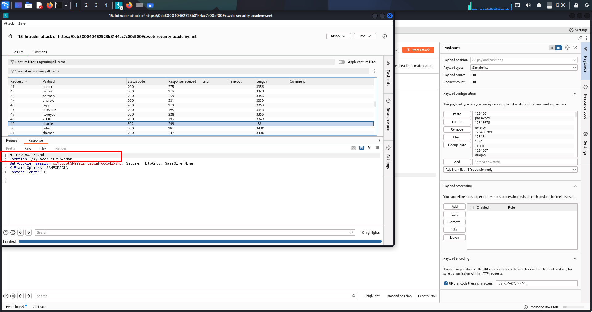

# Authentication Lab-1 — Username enumeration & Password brute-force

---

## 🔹 One-line summary
Identified username enumeration via subtle response differences, then used password brute-force against the discovered account to gain access (PoC attached).

---

## 🔹 Overview
Authentication verifies identity (username/password/MFA). Username enumeration leaks whether an account exists and drastically lowers attacker effort. Once a valid username is known, automated password guessing (brute-force / credential-stuffing) can lead to account takeover and further escalation.

---

## 🔹 Methodology / Lab walkthrough (concise flow)
- *Capture login flow* — with Burp Proxy ON, submit a normal login to capture POST /login (or equivalent).  
- *Manual enumeration check* — in Repeater, replace username with a candidate and use a known-wrong password; observe response differences (status, content-length, headers).  
- *Automated enumeration* — send the captured POST to Intruder with payloads on the username field (wordlist). Sort results by length/status to find the username that produces a different response (valid user).  
- *Password brute-force* — send the login POST to Intruder with payloads on the password field (username fixed to discovered user). Use Sniper or appropriate attack type; detect success by different status/length/redirect/Set-Cookie.  
- *Verify & document* — log in with the found credentials in the browser or Repeater, capture the successful response and screenshot the logged-in page. Save the raw request/response and screenshots as PoC.

---

## 🔹 Repeater / Intruder PoC templates
*Captured login POST (example)*
POST /login HTTP/1.1 Host: <LAB_HOST> Content-Type: application/x-www-form-urlencoded Cookie: session=<SESSION>

username=<CANDIDATE>&password=wrongpassword
*Intruder — username payload position*  
Place §username§ at the username value and load wordlist of candidate usernames.

*Intruder — password payload position*  
Fix username to discovered account, place §password§ at password value and load password list.

---

## 🔹 Proof (evidence)
1. *Username enumeration — differing response*  
     
   (Screenshot: Intruder/Repeater results showing the username entry with a different status/content-length.)

2. *Password brute-force — discovered correct password*  
     
   (Screenshot: Intruder/Repeater hit showing the request/response that indicates a successful login attempt for the discovered username.)

3. *Lab solved — logged-in view / success page*  
     
   (Screenshot: browser showing the logged-in page or lab success confirmation.)

---

## 🔹 Impact
- Fast account discovery → targeted attacks and credential stuffing.  
- Account takeover leads to data theft, abuse of user privileges, and potential vertical escalation (admin takeover).  
- Attackers can use valid accounts to bypass protections, access private features, or pivot.

---

## 🔹 Remediation (short)
- Return uniform error messages & HTTP status codes for authentication failures.  
- Normalize response lengths and avoid side-channel leaks (timing, headers, redirects).  
- Rate-limit and throttle login attempts by IP and account; enforce progressive delays and account lockouts.  
- Enforce MFA for high-value accounts and strong password policies.  
- Monitor/alert on enumeration/brute-force patterns and apply CAPTCHAs when abusive activity is detected.

---

## 🔹 Pentest checklist
- [x] Capture login requests and identify username param.  
- [x] Try manual enumeration in Repeater (wrong password).  
- [x] Automate enumeration with Intruder; sort by length/status.  
- [x] Brute-force password for confirmed username with Intruder (Sniper).  
- [x] Verify successful login, save raw request/response and screenshots.  
- [x] Recommend mitigation steps and re-test after fixes.

---

# Authentication Lab 2 — Username enumeration via subtle response differences (exact playbook)

---

## 🔹 One-line summary
Find a username that returns a subtly different response (status/length/whitespace), then brute-force that user’s password and log in. (Exact method — copy/paste ready.)

---

## 🔹 Overview
This lab demonstrates username enumeration using tiny response differences (content-length, whitespace, punctuation, headers or timing) and targeted password brute-force once a valid username is confirmed. Use Intruder with a Grep-Extract (Fetch Response) to reliably spot the subtle outlier.

---

## 🔹 Methodology / Lab walkthrough (exact steps)
1. *Capture a fresh login POST*  
   - Proxy ON, Intercept OFF. Submit the login form to capture POST /login.  
   - Right-click the captured request → *Send to Intruder*.

2. *Set Intruder positions (username)*  
   - Positions → Clear markers → mark *only* the username field as payload: ...username=§username§&password=...  
   - Edit the password value to a long string (200–400 a chars) to amplify timing/processing differences (optional).

3. *Prime responses (small probe)*  
   - Run 2–3 requests with different usernames to let Intruder collect sample responses (helps Fetch work).

4. *Add Grep-Extract (Fetch Response)*  
   - Options → Grep - Extract → Add → choose Fetch Response.  
   - Highlight the exact standard error message in the preview (include punctuation/period/whitespace). Save extractor.

5. *Load full username list & run attack (Sniper)*  
   - Payloads → load usernames.txt.  
   - Attack type = *Sniper* (or Pitchfork if doing parallel lists).  
   - Throttle: 300–500 ms. Timeout: 10–15 s. Follow redirects: *OFF*.  
   - Start attack.

6. *Identify candidate username(s)*  
   - Sort by *Extracted* column or look for rows where Extracted is empty (i.e., response didn’t match the standard message).  
   - Inspect Raw response for the subtle difference (trailing space, missing period, slight length change). Copy the username.

7. *Password brute-force (for discovered username)*  
   - Capture a fresh login POST (to get fresh tokens), send to Intruder.  
   - Positions → mark *password* only: username=found_user&password=§payload§.  
   - Payloads → load passwords.txt. Attack type = *Sniper*.  
   - Same throttle/timeout settings. Start attack.

8. *Detect successful password*  
   - Watch for different *Status* (e.g., 302), different *Length*, or presence of Set-Cookie/Location header.  
   - Click the outlier row → open Raw → replay in Repeater or browser to verify login.

9. *Verify & capture PoC*  
   - Log in via browser or Repeater using found credentials. Capture screenshot of logged-in page / account (lab solved).  
   - Save the successful raw request + response + screenshots.

---

## 🔹 Repeater / Intruder templates (copy/paste & edit)

*Baseline login POST (example)*
POST /login HTTP/1.1 Host: <LAB_HOST> Content-Type: application/x-www-form-urlencoded Cookie: session=<SESSION>

username=wiener&password=peter

*Intruder username position (amplified password)*
username=§candidate_username§&password=aaaaaaaaaaaaaaaaaaaaaaaaaaaaaaaaaaaaaaaaaaaaaaaa

*Intruder password position (for found username)*
username=found_user&password=§password_payload§

---

## 🔹 What signals to use (priority)
1. Status change (200 → 302 redirect).  
2. Content-Length difference.  
3. Presence of Set-Cookie or Location header.  
4. Slight whitespace/punctuation variation in response body.  
5. Response time (if timing is the only signal — use amplifier).

---

## 🔹 Proof (screenshots)
1. *Username discovered* — Intruder output row showing the discovered username with different Extracted/Length/Status.  
   

2. *Password found* — Intruder/Repeater showing the password guess that produced a success indicator (302/Set-Cookie).  
   

3. *Lab solved — logged-in UI* — screenshot of the target account page / lab success after using found credentials.  
   

(Place the actual screenshots at images/ with the filenames above.)

---

## 🔹 Impact
- Account takeover → data theft, impersonation, further exploitation (IDOR, privilege escalation).  
- If admin or privileged user discovered → full compromise.

---

## 🔹 Remediation (short & report-ready)
- Return identical generic error messages for login failures (no username-specific content).  
- Return same HTTP status code for all authentication failures.  
- Implement rate-limiting and progressive delays per IP & per account.  
- Enforce MFA on privileged accounts.  
- Monitor and alert on enumeration/brute-force patterns.

---

## 🔹 Pentest checklist (copyable)
- [ ] Capture login POST → send to Intruder.  
- [ ] Run username enumeration with Grep-Extract (include punctuation/whitespace).  
- [ ] Narrow candidates and confirm username.  
- [ ] Brute-force password for found username (Sniper).  
- [ ] Verify login & save raw request/response + screenshots.  
- [ ] Report with remediation steps.

---
