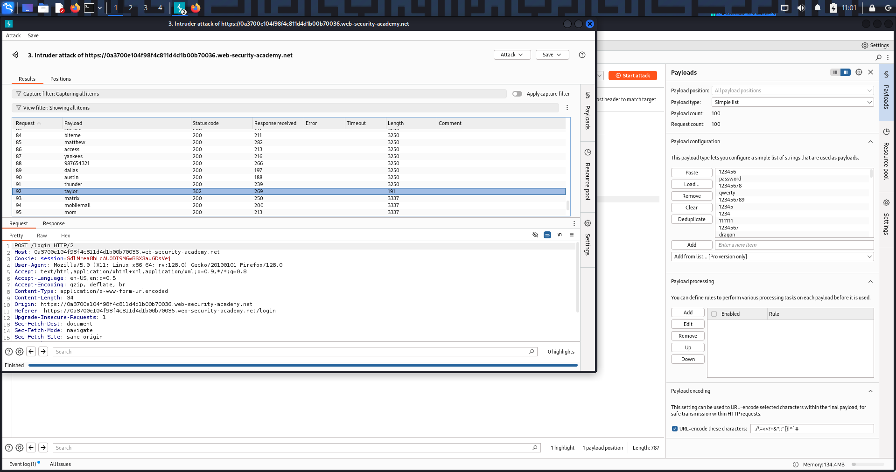

# Authentication Vulnerabilities – Username Enumeration & Password Brute-Force

---

## 🔹 Overview
Authentication vulnerabilities allow attackers to bypass login controls, impersonate users, and gain access to sensitive functionality.  
This write-up focuses on *username enumeration* and *password brute-force* — a common attacker workflow: enumerate valid usernames first, then brute-force passwords for those accounts.

---

## 🔹 Why this is dangerous
- Successful authentication bypass leads to account takeover, data theft, and privilege escalation.  
- Username enumeration drastically reduces brute-force scope.  
- Lack of rate limiting or account lockouts makes automated attacks practical.

---

## 🔹 Methodology / Lab Walkthrough

*Lab goal:* find a valid username (via enumeration), brute-force the password, and log in.

1. *Capture baseline*
   - Logged in as wiener:peter to capture a sample POST /login request and understand parameters.

2. *Username enumeration (Burp Intruder / analysis)*
   - Sent the login request to *Intruder* with payload position on the *username*.
   - Kept password static and loaded a username wordlist.
   - Observed responses (status codes, length, redirect differences) to identify valid username(s).
   - *Found one username with a differing response length — this is the valid username.*

   

3. *Password brute-force*
   - Fixed the discovered username; placed payload position on *password* using a password wordlist.
   - Ran Intruder and monitored for a different response (e.g., redirect, unique body) that indicates a successful guess.
   - *Identified the correct password* from the intruder response.

   

4. *Login & verification*
   - Logged in with the discovered credentials and confirmed account access.
   - Lab solved ✅

   

---

## 🔹 Security Impact
- Account takeover leading to data theft, impersonation, fraud.  
- Attackers can pivot from compromised accounts to escalate privileges or perform lateral actions.  
- Automated attacks at scale become feasible without rate limiting and uniform error handling.

---

## 🔹 Remediation & Best Practices
- Implement *rate limiting* and account lockouts after multiple failed attempts.  
- Use *generic error messages* (don’t reveal whether username vs password was wrong).  
- Normalize response sizes and status codes to avoid leakage via response length or timing.  
- Add *multi-factor authentication (MFA)* for high-privilege accounts.  
- Monitor/auth-log suspicious login attempts and failed enumeration patterns.

---
