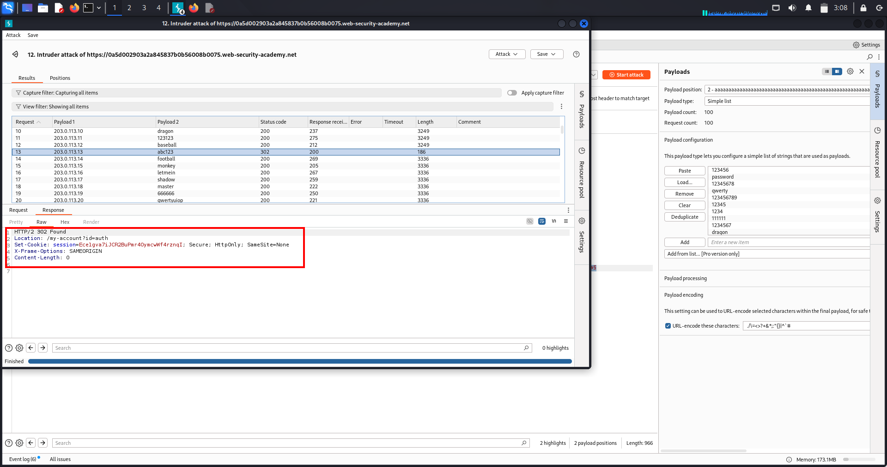
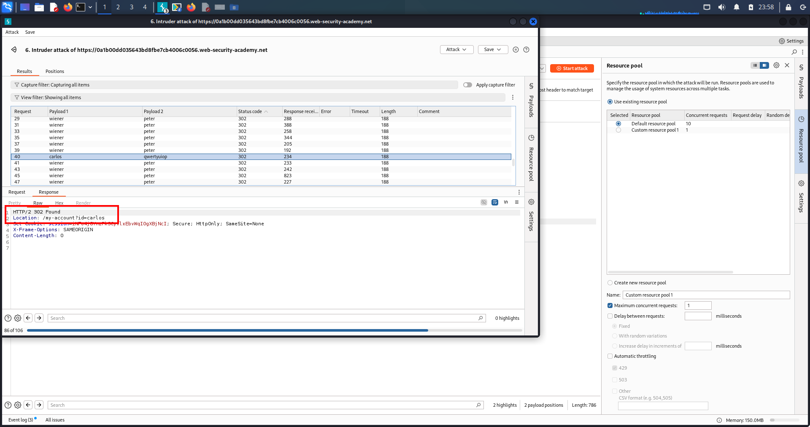
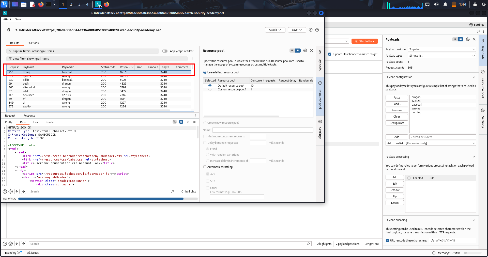
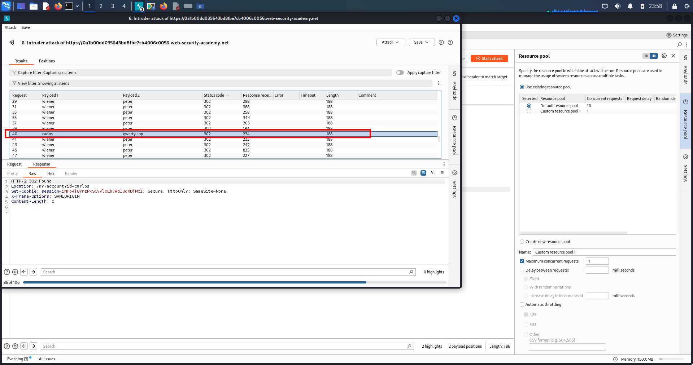
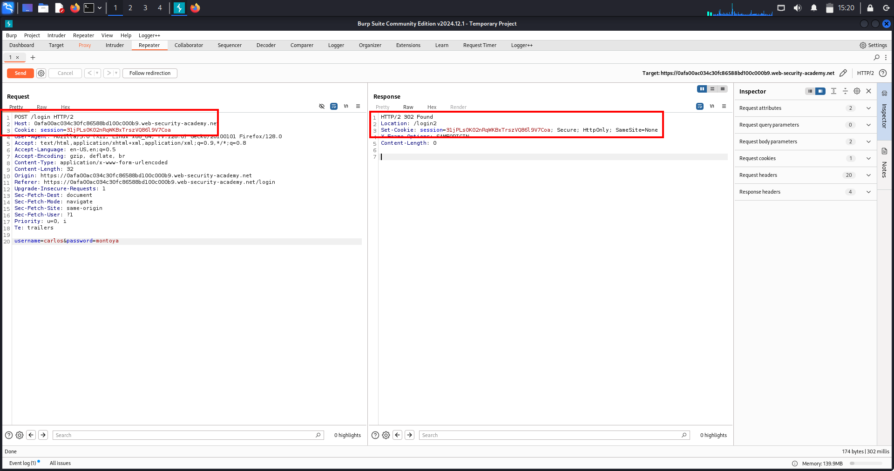
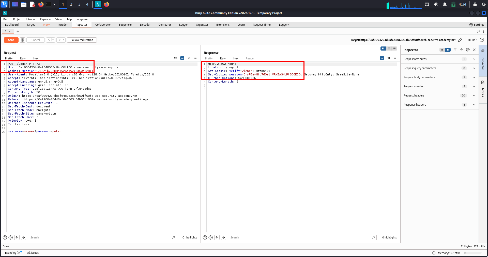
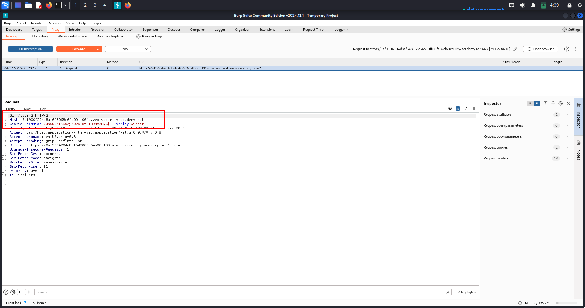
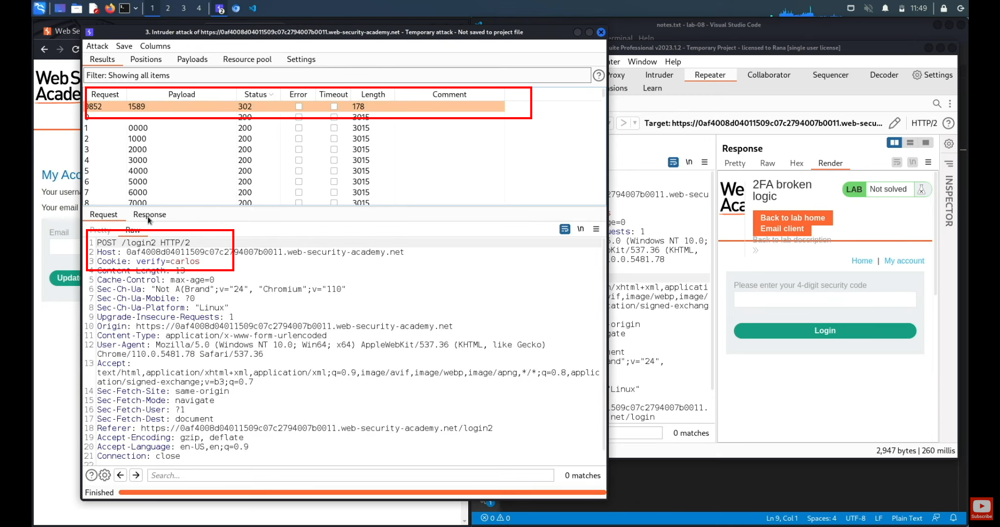
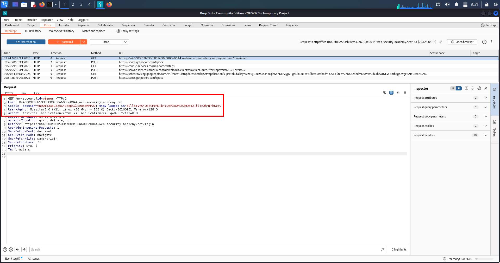
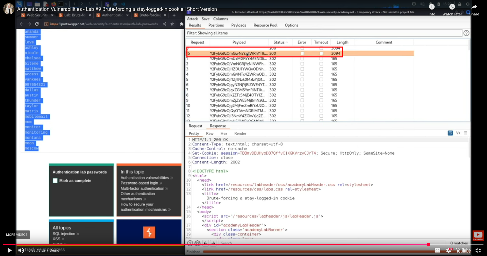

# Authentication Lab-1 — Username enumeration & Password brute-force

---

## 🔹 One-line summary
Identified username enumeration via subtle response differences, then used password brute-force against the discovered account to gain access (PoC attached).

---

## 🔹 Overview
Authentication verifies identity (username/password/MFA). Username enumeration leaks whether an account exists and drastically lowers attacker effort. Once a valid username is known, automated password guessing (brute-force / credential-stuffing) can lead to account takeover and further escalation.

---

## 🔹 Methodology / Lab walkthrough (concise flow)
- *Capture login flow* — with Burp Proxy ON, submit a normal login to capture POST /login (or equivalent).  
- *Manual enumeration check* — in Repeater, replace username with a candidate and use a known-wrong password; observe response differences (status, content-length, headers).  
- *Automated enumeration* — send the captured POST to Intruder with payloads on the username field (wordlist). Sort results by length/status to find the username that produces a different response (valid user).  
- *Password brute-force* — send the login POST to Intruder with payloads on the password field (username fixed to discovered user). Use Sniper or appropriate attack type; detect success by different status/length/redirect/Set-Cookie.  
- *Verify & document* — log in with the found credentials in the browser or Repeater, capture the successful response and screenshot the logged-in page. Save the raw request/response and screenshots as PoC.

---

## 🔹 Repeater / Intruder PoC templates
*Captured login POST (example)*
POST /login HTTP/1.1 Host: <LAB_HOST> Content-Type: application/x-www-form-urlencoded Cookie: session=<SESSION>

username=<CANDIDATE>&password=wrongpassword
*Intruder — username payload position*  
Place §username§ at the username value and load wordlist of candidate usernames.

*Intruder — password payload position*  
Fix username to discovered account, place §password§ at password value and load password list.

---

## 🔹 Proof (evidence)
1. *Username enumeration — differing response*  
     
   (Screenshot: Intruder/Repeater results showing the username entry with a different status/content-length.)

2. *Password brute-force — discovered correct password*  
     
   (Screenshot: Intruder/Repeater hit showing the request/response that indicates a successful login attempt for the discovered username.)

3. *Lab solved — logged-in view / success page*  
     
   (Screenshot: browser showing the logged-in page or lab success confirmation.)

---

## 🔹 Impact
- Fast account discovery → targeted attacks and credential stuffing.  
- Account takeover leads to data theft, abuse of user privileges, and potential vertical escalation (admin takeover).  
- Attackers can use valid accounts to bypass protections, access private features, or pivot.

---

## 🔹 Remediation (short)
- Return uniform error messages & HTTP status codes for authentication failures.  
- Normalize response lengths and avoid side-channel leaks (timing, headers, redirects).  
- Rate-limit and throttle login attempts by IP and account; enforce progressive delays and account lockouts.  
- Enforce MFA for high-value accounts and strong password policies.  
- Monitor/alert on enumeration/brute-force patterns and apply CAPTCHAs when abusive activity is detected.

---

## 🔹 Pentest checklist
- [x] Capture login requests and identify username param.  
- [x] Try manual enumeration in Repeater (wrong password).  
- [x] Automate enumeration with Intruder; sort by length/status.  
- [x] Brute-force password for confirmed username with Intruder (Sniper).  
- [x] Verify successful login, save raw request/response and screenshots.  
- [x] Recommend mitigation steps and re-test after fixes.

---

# Authentication Lab 2 — Username enumeration via subtle response differences 

---

## 🔹 One-line summary
Find a username that returns a subtly different response (status/length/whitespace), then brute-force that user’s password and log in. (Exact method — copy/paste ready.)

---

## 🔹 Overview
This lab demonstrates username enumeration using tiny response differences (content-length, whitespace, punctuation, headers or timing) and targeted password brute-force once a valid username is confirmed. Use Intruder with a Grep-Extract (Fetch Response) to reliably spot the subtle outlier.

---

## 🔹 Methodology / Lab walkthrough 
1. *Capture a fresh login POST*  
   - Proxy ON, Intercept OFF. Submit the login form to capture POST /login.  
   - Right-click the captured request → *Send to Intruder*.

2. *Set Intruder positions (username)*  
   - Positions → Clear markers → mark *only* the username field as payload: ...username=§username§&password=...  
   - Edit the password value to a long string (200–400 a chars) to amplify timing/processing differences (optional).

3. *Prime responses (small probe)*  
   - Run 2–3 requests with different usernames to let Intruder collect sample responses (helps Fetch work).

4. *Add Grep-Extract (Fetch Response)*  
   - Options → Grep - Extract → Add → choose Fetch Response.  
   - Highlight the exact standard error message in the preview (include punctuation/period/whitespace). Save extractor.

5. *Load full username list & run attack (Sniper)*  
   - Payloads → load usernames.txt.  
   - Attack type = *Sniper* (or Pitchfork if doing parallel lists).  
   - Throttle: 300–500 ms. Timeout: 10–15 s. Follow redirects: *OFF*.  
   - Start attack.

6. *Identify candidate username(s)*  
   - Sort by *Extracted* column or look for rows where Extracted is empty (i.e., response didn’t match the standard message).  
   - Inspect Raw response for the subtle difference (trailing space, missing period, slight length change). Copy the username.

7. *Password brute-force (for discovered username)*  
   - Capture a fresh login POST (to get fresh tokens), send to Intruder.  
   - Positions → mark *password* only: username=found_user&password=§payload§.  
   - Payloads → load passwords.txt. Attack type = *Sniper*.  
   - Same throttle/timeout settings. Start attack.

8. *Detect successful password*  
   - Watch for different *Status* (e.g., 302), different *Length*, or presence of Set-Cookie/Location header.  
   - Click the outlier row → open Raw → replay in Repeater or browser to verify login.

9. *Verify & capture PoC*  
   - Log in via browser or Repeater using found credentials. Capture screenshot of logged-in page / account (lab solved).  
   - Save the successful raw request + response + screenshots.

---

## 🔹 Repeater / Intruder templates 

*Baseline login POST (example)*
POST /login HTTP/1.1 Host: <LAB_HOST> Content-Type: application/x-www-form-urlencoded Cookie: session=<SESSION>

username=wiener&password=peter

*Intruder username position (amplified password)*
username=§candidate_username§&password=aaaaaaaaaaaaaaaaaaaaaaaaaaaaaaaaaaaaaaaaaaaaaaaa

*Intruder password position (for found username)*
username=found_user&password=§password_payload§

---

## 🔹 What signals to use (priority)
1. Status change (200 → 302 redirect).  
2. Content-Length difference.  
3. Presence of Set-Cookie or Location header.  
4. Slight whitespace/punctuation variation in response body.  
5. Response time (if timing is the only signal — use amplifier).

---

## 🔹 Proof (screenshots)
1. *Username discovered* — Intruder output row showing the discovered username with different Extracted/Length/Status.  
   

2. *Password found* — Intruder/Repeater showing the password guess that produced a success indicator (302/Set-Cookie).  
   

3. *Lab solved — logged-in UI* — screenshot of the target account page / lab success after using found credentials.  
   

(Place the actual screenshots at images/ with the filenames above.)

---

## 🔹 Impact
- Account takeover → data theft, impersonation, further exploitation (IDOR, privilege escalation).  
- If admin or privileged user discovered → full compromise.

---

## 🔹 Remediation (short & report-ready)
- Return identical generic error messages for login failures (no username-specific content).  
- Return same HTTP status code for all authentication failures.  
- Implement rate-limiting and progressive delays per IP & per account.  
- Enforce MFA on privileged accounts.  
- Monitor and alert on enumeration/brute-force patterns.

---

## 🔹 Pentest checklist 
- [ ] Capture login POST → send to Intruder.  
- [ ] Run username enumeration with Grep-Extract (include punctuation/whitespace).  
- [ ] Narrow candidates and confirm username.  
- [ ] Brute-force password for found username (Sniper).  
- [ ] Verify login & save raw request/response + screenshots.  
- [ ] Report with remediation steps.

---

# Authentication Lab-3 — Username enumeration via response timing (IP rotation) 

---

## 🔹 One-line summary
Enumerate a valid username using subtle response timing differences (amplified by long passwords), rotate IP via X-Forwarded-For to bypass IP lockout, then brute-force the discovered user’s password and log in. (Exact steps — copy/paste ready.)

---

## 🔹 Overview
This lab uses timing differences (and optional IP rotation via X-Forwarded-For) to detect valid usernames that return subtly different server processing times. Once a username is confirmed, rotate source IPs when brute-forcing the password to avoid IP-based lockouts. Use Intruder (Pitchfork / Cluster Bomb) with amplified requests to reliably spot timing signals.

---

## 🔹 Methodology / Lab walkthrough (exact steps)

1. *Capture a fresh login POST*  
   - Proxy ON. Submit the login form once to capture POST /login.  
   - Right-click the captured request → *Send to Repeater*.

2. *Confirm X-Forwarded-For support*  
   - In Repeater add header X-Forwarded-For: 203.0.113.55 → *Send*.  
   - If lockout behavior changes, IP rotation is possible. If not, IP lockout may be per-account — proceed with caution.

3. *Send request to Intruder*  
   - Repeater → *Send to Intruder*.

4. *Positions — prepare enumeration (Pitchfork)*  
   - Positions → Clear markers.  
   - Add marker 1 on the last octet part of X-Forwarded-For: 203.0.113.§IP§ (Payload set 1).  
   - Add marker 2 on username (Payload set 2).  
   - Set password to a long constant (≈100–400 a chars) to amplify server processing time.

5. *Payloads for enumeration*  
   - Payload set 1 (IP octets): Numbers 1..N (or a small IP list).  
   - Payload set 2 (usernames): load candidate_usernames.txt.  
   - Attack type: *Pitchfork* (pairs IP[i] with USER[i]).  
   - Options: Throttle 300–500 ms, Timeout 10–15 s, Follow redirects OFF.

6. *Run & inspect timing*  
   - Start the attack. Enable timing columns (Response completed / Time).  
   - Sort by Response Time; look for a username with consistently higher response time (or unique response size).

7. *Confirm candidate*  
   - Click the candidate row → Send to Repeater → resend 2–3× to confirm consistent timing or body difference.

8. *Prepare brute-force (Cluster Bomb — IP × password)*  
   - Get a fresh POST /login into Repeater (fresh CSRF/session). → Send to Intruder.  
   - Positions: add marker for X-Forwarded-For: §IP§ (payload set 1) and marker on password=§PASSWORD§ (payload set 2). Keep username=identified-user fixed.  
   - Payload set 1: list of IPs (ips.txt) or number range.  
   - Payload set 2: candidate_passwords.txt.  
   - Attack type: *Cluster Bomb*. Throttle 400–700 ms, Timeout 10–15 s. Run a small smoke test first.

9. *Detect success & verify*  
   - Watch for Status = 302, Set-Cookie, Location: /my-account or reduced Length.  
   - Click the hit → open Raw → replay in Repeater or browser.  
   - Verify login and capture the logged-in UI screenshot (lab solved). Save raw request/response.

---

## 🔹 Repeater / Intruder templates 

*Enumeration (Pitchfork — password amplifier)*

POST /login HTTP/1.1 Host: <LAB_HOST> X-Forwarded-For: 203.0.113.§IP§ Content-Type: application/x-www-form-urlencoded Cookie: session=<SESSION>

username=§USERNAME§&password=aaaaaaaaaaaaaaaaaaaaaaaaaaaaaaaaaaaaaaaaaaaaaaaa

- Payload set 1 (IP): Numbers 1..N or ips.txt  
- Payload set 2 (USERNAME): candidate_usernames.txt  
- Attack type: Pitchfork

*Brute-force (Cluster Bomb — rotate IP × password)*
POST /login HTTP/1.1 Host: <LAB_HOST> X-Forwarded-For: §IP§ Content-Type: application/x-www-form-urlencoded Cookie: session=<SESSION>

username=identified-user&password=§PASSWORD§

- Payload set 1 (IP): ips.txt  
- Payload set 2 (PASSWORD): candidate_passwords.txt  
- Attack type: Cluster Bomb

---

## 🔹 Troubleshooting & tips
- No timing signal → increase password length (400–800 `a`s) and re-test a small subset.  
- Too many timeouts/errors → increase throttle or reduce IP set.  
- CSRF/tokens rotate → always start Intruder runs from a fresh Repeater capture.  
- If IP rotation not usable, consider lower-volume brute-force with long delays and monitoring.

---

## 🔹 Proof (screenshots)
1. *Username enumeration — timing outlier*  
   

2. *Password brute-force hit (rotated IP)*  
   

3. *Lab solved — logged-in target account*  
   

---

## 🔹 Impact
- Account takeover; lateral access to user data and further escalation.  
- If repeated at scale, can lead to mass account compromise.

---

## 🔹 Remediation (short)
- Normalize login failure responses (no timing/behavior differences).  
- Reject/monitor suspicious ips / X-Forwarded-For header usage; validate proxy headers.  
- Implement per-account rate-limits and progressive delays; require MFA for sensitive accounts.  
- Log and alert on unusual IP rotation patterns.

---

## 🔹 Pentest checklist
- [ ] Confirm X-Forwarded-For behavior.  
- [ ] Run Pitchfork username enumeration (long password amplifier).  
- [ ] Confirm candidate username by replaying.  
- [ ] Run Cluster Bomb for password × IP rotation (small smoke test first).  
- [ ] Verify login & capture PoC (raw request/response + screenshots).

---

# Broken brute-force protection — Lab-4: bypass lockout by alternating successful logins

---

## 🔹 One-line summary
By interleaving successful logins for an attacker account (wiener:peter) with guesses for the victim (carlos:<wordlist>), the server’s brute-force counter never reaches the block threshold — resulting in a successful password guess for the victim (PoC attached).

---

## 🔹 Overview
Brute-force protection should limit repeated login attempts per account and/or per IP. If the protection logic resets counters incorrectly (for example, when an unrelated account logs in), an attacker can keep guessing while avoiding lockout. This lab shows how to exploit that logic flaw by alternately authenticating a safe account and guessing the target account.

---

## 🔹 High-level idea
Alternate a valid attacker login (to reset or avoid IP block) with one guess for the victim account — send the requests sequentially so the server never accumulates enough consecutive failures to block the IP.

---

## 🔹 Methodology / Lab walkthrough (exact flow)
1. *Capture a fresh login POST*  
   - Proxy ON; perform a normal login to capture POST /login (fresh CSRF/session).  
   - Right-click captured request → *Send to Intruder*.

2. *Prepare aligned payload lists*  
   - usernames_alternating.txt: lines alternate wiener, carlos, wiener, carlos, ... (start with wiener).  
   - passwords_alternating.txt: lines alternate peter, <guess1>, peter, <guess2>, ... (every wiener line corresponds to peter).

3. *Intruder positions*  
   - Positions → Clear markers.  
   - Mark username as payload position 1 and password as payload position 2:  
     username=§1§&password=§2§

4. *Load payloads & set attack type*  
   - Payload position 1 → Simple list → load usernames_alternating.txt.  
   - Payload position 2 → Simple list → load passwords_alternating.txt.  
   - Attack type → *Pitchfork* (pairs nth username with nth password).

5. *Enforce sequential requests*  
   - Resource pool / Threads = 1 (maximum concurrent requests = 1) so requests are strictly sequential.  
   - Options: Throttle ≈ 300–500 ms, Timeout 10–15 s, Follow redirects = OFF.

6. *Run attack & look for success*  
   - Start the attack. Because wiener:peter appears regularly, the server’s block counter should not reach the threshold.  
   - Filter or sort results to hide normal failures and inspect rows for carlos producing a success indicator (e.g., 302, Location: /my-account, Set-Cookie).

7. *Verify & PoC*  
   - Right-click the hit → *Send to Repeater* → *Send* once → confirm 302 + Location/Set-Cookie.  
   - Login in a browser or replay Repeater to confirm access and lab solved. Save the raw request/response and one screenshot (PoC).

---

## 🔹 Repeater / Intruder template 

*Intruder base*

POST /login HTTP/1.1 Host: <LAB_HOST> Content-Type: application/x-www-form-urlencoded Cookie: session=<SESSION> User-Agent: ... Accept: / Connection: close

username=§1§&password=§2§

*Example small payload sample*

usernames_alternating.txt wiener carlos wiener carlos ...

passwords_alternating.txt peter 123456 peter password ...

---

## 🔹 What to look for (success signals)
- HTTP 302 redirect to account page (Location: /my-account).  
- Set-Cookie: session=... present in response.  
- Response Length / Status different compared to failures.

---

## 🔹 Proof / Evidence

*PoC — successful victim login (302 response)*  
Screenshot shows the Intruder/Repeater row where the victim account returned a 302 (Location / Set-Cookie), proving the brute-force succeeded while alternating attacker logins prevented lockout.  

## 🔹 Impact
- Account takeover of the targeted user → data theft, fraud, escalation.  
- If repeated, can lead to mass compromise of user accounts in a system with the same flawed logic.

---

## 🔹 Remediation (short)
- Scope counters correctly (per-account and/or per-IP) and *do not* reset failure counters based on unrelated successful logins.  
- Use progressive delays and exponential backoff; lockout should not be reset by unrelated events.  
- Require MFA for sensitive accounts.  
- Monitor and alert on alternating-success patterns and unusual sequences of login attempts.

---

## 🔹 Pentest checklist 
- [ ] Confirm lockout threshold (fail X times → blocked).  
- [ ] Test whether successful login for other account resets counters.  
- [ ] Build alternating lists and run Pitchfork with threads = 1.  
- [ ] Identify the 302 Hit for victim credentials.  
- [ ] Verify in browser; save PoC (raw request/response + screenshot).  
- [ ] Report with remediation.

---

# Account-lock Username Enumeration — Lab-5: repeat each username N times (Cluster Bomb + Null payloads)

---

## 🔹 One-line summary
Repeat each username exactly *N* times (the account-lock threshold) to trigger a lock response for real accounts, then brute-force the confirmed username’s password. (Copy-paste ready.)

---

## 🔹 Overview
Some applications reveal account existence via lockout behaviour: after *N* failed attempts a specific “locked” response appears. By sending every username *N* times and detecting that lock response, an attacker can enumerate valid accounts and then brute-force the confirmed account.

---

## 🔹 Methodology / Lab walkthrough (exact steps)
1. *Capture a fresh login POST*  
   - Proxy *ON*; submit an invalid login to capture POST /login (fresh CSRF/session).  
   - Right-click → *Send to Intruder*.

2. *Positions — set markers exactly*  
   - Intruder → *Positions* → Clear markers.  
   - Mark *username* as payload *pos 1* and *password* as payload *pos 2*.  
   - Add a second (null) payload marker immediately after the password so the body looks like:  
     
     username=§1§&password=example§§
     
     (the second § is the null payload used to repeat each username *N* times).

3. *Payloads — Cluster Bomb with null generator*  
   - Attack type → *Cluster Bomb*.  
   - Payload 1 → *Simple list* → load usernames.txt.  
   - Payload 2 → *Null payloads* → *Generate N payloads = 5* (set *N* to the lab threshold).  
   - Preview should show total payloads = #usernames × N.

4. *Execution options*  
   - Threads / Resource pool = *1* (strict sequential sending).  
   - Throttle ≈ *300–500 ms*.  
   - Timeout *10–15 s*.  
   - Follow redirects = *OFF*.

5. *Run attack*  
   - Each username will be sent *N* times in sequence (same password).  
   - Inspect results for outliers: responses that contain the lock message (e.g., “You have made too many incorrect login attempts.”) or show different *Length/Status*.

6. *Confirm locked username*  
   - Right-click an outlier → *Show response* → verify the lock text/indicator. Note the username.

7. *Brute-force the confirmed account (Sniper)*  
   - Capture a fresh POST /login → Send to Intruder.  
   - Positions: fix username=<confirmed> (no marker) and mark password=§1§.  
   - Payload → Simple list → candidate_passwords.txt.  
   - Attack type → *Sniper*, Threads = 1, Throttle 300–500 ms, Follow redirects = OFF.  
   - Optionally add a Grep-Extract for the lock message to highlight rows that *do not* contain it.

8. *Verify & PoC*  
   - Right-click the hit → *Send to Repeater* → *Send* once → confirm 302 / Location / Set-Cookie.  
   - Log in in browser with the found credentials (wait unlock time if required).  
   - Save the successful raw request/response and screenshots.

---

## 🔹 Repeater / Intruder templates 

*Cluster Bomb enumeration (positions)*

POST /login HTTP/1.1 Host: <LAB_HOST> Content-Type: application/x-www-form-urlencoded Cookie: session=<SESSION>

username=§1§&password=example§§

- Payload pos 1 → usernames.txt  
- Payload pos 2 → Null payloads → Generate *N* = <lock threshold>

*Sniper (password brute-force for confirmed username)*

POST /login HTTP/1.1 Host: <LAB_HOST> Content-Type: application/x-www-form-urlencoded Cookie: session=<SESSION>

username=<confirmed-username>&password=§1§

- Payload pos 1 → candidate_passwords.txt

---

## 🔹 Proof / Evidence

1. *Username locked (enumeration PoC)* — shows the Intruder row where the username hit the lock threshold (Nth attempt).  
   

2. *Password found (brute-force PoC)* — shows the Intruder/Repeater row where the correct password produced a 302 (Location / Set-Cookie), confirming login.  
   

---

## 🔹 What to look for (signals)
- Response body text containing lock message (exact string).  
- Content-Length change for the Nth attempt.  
- Status differences or timing changes.

---

## 🔹 Remediation (short)
- Do *not* reveal lock state in response bodies/headers/timings.  
- Use identical, generic failure messages for invalid credentials and locked states.  
- Scope lockouts properly (per-account and/or per-IP) and avoid attacker-controllable reset triggers.  
- Use progressive delays, MFA for high-value users, monitoring and alerts on enumeration patterns.

---

## 🔹 Pentest checklist 
- Capture fresh login request (fresh CSRF/session).  
- Cluster Bomb: usernames × Null payloads (*N* = lock threshold).  
- Identify locked usernames from outlier responses.  
- Sniper brute-force confirmed username’s password.  
- Verify; save raw requests/responses + screenshots for PoC.

---

# User Rate Limiting & HTTP Basic Authentication — Notes 

---

## 🔹 One-line summary
User rate limiting and HTTP Basic Authentication are two common authentication-related behaviours/defences — rate limiting helps slow brute-force attempts while HTTP Basic Auth is a simple, legacy scheme that often lacks modern protections. Both have important weaknesses an attacker can exploit if misconfigured.

---

## 🔹 User rate limiting

### What is it?
User rate limiting blocks or slows requests from an IP (or other client identifier) that sends too many login attempts in a short period. Unblocking typically occurs by:
- automatic expiry after a timeout, or  
- manual admin intervention, or  
- successful CAPTCHA / challenge completion by the user.

### Why it matters (real-world risk)
- Rate limiting reduces brute-force velocity but can still be bypassed (IP spoofing, proxy rotation, header manipulation).  
- If implemented per-account, it can enable username enumeration.  
- If implemented per-IP, a distributed attack (many IPs) or IP rotation can bypass it.  
- Poor implementations may allow an attacker to pack multiple guesses into a single request (application-specific weaknesses).

### Common bypass techniques
- Rotate outgoing IP via proxies / botnets / X-Forwarded-For header (if the server trusts it).  
- Use parallel distributed requests from many IPs.  
- Find ways to submit multiple password guesses in a single request (application-specific chaining).  
- Interleave legitimate actions (e.g., successful login to another account) to reset counters (logic flaws).

### Testing checklist
- Verify the lockout threshold and block duration.  
- Test per-IP vs per-account behaviour (does a blocked IP affect other accounts?).  
- Test X-Forwarded-For / X-Real-IP handling — does the app trust client-supplied headers?  
- Attempt low-volume distributed guessing (simulate different source IPs) to see if the limit is per-IP only.  
- Try to place multiple guesses inside one request if the app accepts batched/compound inputs.

### Remediation (recommendations)
- Prefer per-account rate limiting combined with progressive delays and exponential backoff.  
- Do not rely on client-supplied headers for source IP (validate/load-balancer config).  
- Add CAPTCHAs or challenge-based hurdles after suspicious activity.  
- Implement global anomaly detection and per-user + per-IP throttling.  
- Log & alert on distributed or alternating attack patterns.

---

## 🔹 HTTP Basic Authentication

### What is HTTP Basic Auth?
A simple HTTP authentication scheme where the client sends credentials in the Authorization header on every request:

Authorization: Basic <base64(username:password)>

The header is created by concatenating username:password and base64-encoding the result.

### Why it matters (real-world risk)
- Credentials are transmitted on every request — if TLS is absent or misconfigured, credentials are trivial to intercept.  
- Often paired with sites that lack modern defenses (no rate limiting, no account lockouts, etc.).  
- Basic Auth tokens are static and therefore trivially brute-forceable if the server does not implement protections.  
- Basic Auth does not provide CSRF protections by itself (browsers attach Authorization automatically in some contexts), increasing CSRF risk.

### Common pitfalls / attack vectors
- No TLS / incomplete HSTS → credentials exposed to MitM.  
- No brute-force/lockout protections on the endpoint that consumes the Authorization header.  
- Reuse of credentials across services — compromise of one service leaks credentials usable elsewhere.  
- Basic auth endpoints sometimes serve low-visibility admin pages which still hold sensitive functionality or data.

### Detection & testing
- Check for WWW-Authenticate: Basic responses on endpoints.  
- Attempt brute-force against the Basic Auth endpoint (use slow, careful testing to avoid service disruption).  
- Inspect application behaviour when supplying invalid vs valid credentials (look for enumeration signals).  
- Confirm whether the site accepts credentials over plain HTTP or enforces TLS/HSTS.

### Remediation 
- Avoid using HTTP Basic Auth for user-facing authentication. Use modern session or token-based authentication (OAuth2, JWT with proper controls) instead.  
- Enforce HTTPS + HSTS for any Basic Auth use (never send credentials over plain HTTP).  
- Implement rate-limiting, account lockouts, and CAPTCHA for Basic Auth protected endpoints.  
- Where Basic Auth is required (e.g., internal services), restrict access by IP/ACLs and require additional layers (VPN, mTLS).  
- Log and monitor access attempts to Basic Auth endpoints for brute-force or anomalous patterns.

---

# 2FA bypass Lab-6 — Session issued before OTP — Notes 

---

## 🔹 One-line summary
If the server issues a fully authenticated session (cookie/token) immediately after password validation — before verifying the OTP — an attacker can reuse that session to access protected pages and bypass 2FA.

---

## 🔹 What is this vulnerability?
When the server sets a session cookie or issues an auth token as soon as the password step succeeds (and before the 2FA/OTP step), that session can be used on protected endpoints without supplying the second factor. This defeats the whole point of 2FA.

---

## 🔹 Why this matters (real-world risk)
- Full account takeover despite 2FA being enabled.  
- Read sensitive data, change account details, abuse features.  
- Gives a false sense of security while the implementation is broken.

---

## 🔹 Quick technical summary
Typical bad flow:
1. POST /login with username+password → server validates password.  
2. Server sets Set-Cookie (session) or returns a token and redirects to /2fa.  
3. Before OTP verification, that session can access /my-account and other protected endpoints — attacker reuses the session and bypasses OTP.

The exploit: capture the session token from the POST /login response and reuse it on protected endpoints.

---

## 🔹 Top priority endpoints to check
- POST /login, POST /session, POST /authenticate  
- GET /2fa, POST /2fa (OTP verify)  
- GET /my-account, /inbox, /messages, /dashboard  
- POST /api/login, token endpoints, SSO callbacks

---

## 🔹 Lab walkthrough — exact, copy-paste friendly methodology

1. *Capture a fresh login POST*  
   - In browser submit the victim credentials (do not enter OTP). Capture POST /login in Burp Proxy.

2. *Send the password POST to Repeater*  
   - Proxy → HTTP history → find the POST /login → *Send to Repeater*.

3. *Inspect the login response for a session / token*  
   - In Repeater click *Send* and check Response headers for Set-Cookie: <name>=<value> or check the body for a JSON token.  
   - If not in the immediate response, check the subsequent redirect response(s) in Proxy history.

4. *Replay a protected GET using the copied session*  
   - Create a GET /my-account in Repeater and add header:  
     Cookie: session=<PASTED_SESSION_VALUE>  
   - *Send*. If you receive the account page (200 + victim data) without entering OTP — bypass confirmed.

5. *Alternative: follow redirect*  
   - Replay the redirect URL returned by login with the copied cookie (some apps require following flow).

6. *Record proof*  
   - Save raw POST /login + response (shows Set-Cookie).  
   - Save raw GET /my-account + response using the session (shows victim data).  
   - Screenshot the account/inbox page. These are your PoC artifacts.

7. *Optional checks*  
   - Test other protected endpoints with same cookie to confirm scope.  
   - Do not perform destructive actions; collect evidence only.

---

## 🔹 Repeater / PoC templates 

*Captured password POST (example)*  
(replace with your captured request when reporting)

POST /login HTTP/1.1 Host: <LAB_HOST> Content-Type: application/x-www-form-urlencoded

username=carlos&password=montoya

*Protected page GET (use session from POST response)*

GET /my-account HTTP/1.1 Host: <LAB_HOST> Cookie: session=<SESSION_VALUE_FROM_LOGIN> User-Agent: Mozilla/5.0 Accept: text/html Connection: close

If the GET returns account content without OTP, the vulnerability is confirmed.

---

## 🔹 Proof / Evidence

1. *Captured login response (session issued)* — shows the POST /login response headers containing Set-Cookie (session) and related headers used to build the authenticated request.  
   

2. *Replayed GET with copied session (bypass)* — shows the modified GET /my-account response using the session value copied from the POST /login response; confirms access without OTP.  
   

---

## 🔹 Detection indicators (what defenders see)
- Set-Cookie or token issued on password validation response.  
- Access to protected endpoints using a session issued before 2FA completion.  
- Logs showing session creation without 2FA event.

---

## 🔹 Quick remediation checklist
- *Do not* issue a full auth session until 2FA is verified.  
- Use a short-lived, limited “pre-auth” token that cannot access protected resources.  
- Promote session only after OTP verification; make pre-auth tokens distinct (different cookie name / restricted scope).  
- Ensure protected endpoints check a server-side mfa_completed flag.  
- Normalize responses/timing during 2FA flow to avoid leaking state.

---

## 🔹 Pentest checklist 
1. Capture POST /login using victim creds (don’t enter OTP).  
2. Inspect response headers/body for Set-Cookie / tokens.  
3. Replay protected GETs with the found token to verify bypass.  
4. Save raw req/resp (login + protected GET) and a screenshot as PoC.  
5. Recommend pre-auth tokens + server-side 2FA checks.

---

# 2FA verification logic flaw (Lab-7) 

---

## 🔹 One-line summary
A client-controllable verify (or equivalent) parameter lets an attacker generate and brute-force OTPs for any user. If the server ties verification to that client value instead of server-side state, an attacker can gain access to victims’ accounts by submitting OTPs while authenticated as their own session.

---

## 🔹 What is this vulnerability?
When the server accepts a client-supplied identifier (e.g. verify=<username>) for OTP generation/verification, an attacker can:
1. Trigger OTP generation for a victim,  
2. Submit OTP attempts while authenticated in their own session (with verify switched to the victim), and  
3. Gain access if the correct OTP is guessed — because verification is not bound to server-side session state.

This breaks the server-side binding required for secure multi-factor auth.

---

## 🔹 Why this matters (real-world risk)
- Attackers can generate/verify OTPs for arbitrary users and brute-force them.  
- 2FA can be bypassed without knowing passwords.  
- Full account takeover, PII exposure, unauthorized transactions, and further escalation are possible.

---

## 🔹 High-value places to check
- GET /login2?verify=<user> and other 2FA generation endpoints.  
- POST /login2, /2fa/verify, /otp/verify (OTP submission handlers).  
- Hidden form fields on 2FA page (verify, mfa_token, state).  
- GET /my-account, /inbox, /messages — protected pages to validate access.

(Grep keywords: verify=, mfa, otp, two-factor, mfa_token, Set-Cookie.)

---

## 🔹 Exact lab walkthrough/Methodology
(Authorized testing only.)

1. *Login as control user* (e.g. wiener:peter) with Burp Proxy ON; observe the 2FA flow to capture the structure of requests.

2. *Log out* (clean session).

3. *Generate victim code*  
   - Send GET /login2?verify=carlos to Repeater (or use browser) — this triggers generation of an OTP for carlos.  
   - Save the request/response.

4. *Capture OTP submission template*  
   - Log in as control user again and, at 2FA prompt, submit an invalid code to generate a POST /login2 request.  
   - In Proxy → HTTP history locate that POST /login2 and *Send to Intruder*.

5. *Prepare Intruder*  
   - Intruder → Positions → Clear markers.  
   - Edit the request to set verify=carlos (in body/query) and mark only the OTP field as payload, e.g.: mfa-code=§1§.  
   - Attack type: *Sniper*. Threads = 1. Throttle 300–500 ms. Follow redirects = OFF.  
   - Payloads: Numbers → generate 0000 → 9999 (pad to lab digit length).

6. *Run attack & detect success*  
   - Watch for success signal: 302 redirect to account, Set-Cookie promoting session, or a distinct response length/status.  
   - Sort results by Status/Length to spot the hit.

7. *Verify*  
   - Open the successful response in the browser / use the Location redirect to load /my-account and confirm access to the victim’s account.

8. *Collect PoC*  
   - Save GET /login2?verify=carlos (request).  
   - Save the successful POST /login2 (request + 302 response).  
   - Save GET /my-account (shows victim data) and screenshot for evidence.

---

## 🔹 Proof / Evidence

1. *Login response → redirect to /login2* — shows the POST /login response headers (302/Location → /login2) and any Set-Cookie / session headers issued at the password step.  
   

2. *Generate victim OTP (GET verify=carlos)* — shows the GET /login2?verify=carlos request/response used to create an OTP for the victim account.  
   

3. *OTP brute-force success (Intruder hit / promoted session)* — shows the Intruder/Repeater row or response where the correct mfa-code returned a 302 / Set-Cookie (session promoted), confirming access to the victim account.  
   

---

## 🔹 Repeater / Intruder PoC templates 

*Generate victim code (GET)*

GET /login2?verify=carlos HTTP/1.1 Host: <LAB_HOST> Cookie: session=<YOUR_SESSION> Connection: close

*OTP submission (Intruder template)*

POST /login2 HTTP/1.1 Host: <LAB_HOST> Content-Type: application/x-www-form-urlencoded Cookie: session=<YOUR_SESSION>

verify=carlos&mfa-code=§1§&mfa_token=<CAPTURED_TOKEN>&...

- Payload 1: Numbers 0000–9999 (pad to lab length).  
- Attack type: *Sniper*, Threads = 1, Throttle 300–500 ms, Follow redirects = OFF.

---

## 🔹 Detection indicators (what defenders see)
- Many GET /login2?verify=<different-users> from same source.  
- High rate of POST /login2 OTP attempts tied to a client-supplied verify value.  
- Successful POST /login2 followed by immediate access to /my-account without server-side session identity checks.

---

## 🔹 Quick remediation checklist
- *Bind OTP generation & verification to server-side session* (store pending target server-side).  
- Reject client-supplied identity (verify) as the authoritative target.  
- Rate-limit OTP attempts and alert on anomalies.  
- Short OTP TTL, monitor issuance, and lock / challenge after multiple failures.  
- Sign/encrypt client state if any client token is needed — prefer server-only mapping.

---

## 🔹 Pentest checklist 
1. Find GET /login2 or similar generation endpoint.  
2. Trigger OTP generation for a target (verify=<victim>).  
3. Capture the POST /login2 template by submitting an invalid code as control user.  
4. Intruder: set verify=<victim> and brute-force mfa-code (Sniper). Threads = 1.  
5. Detect success via 302/Set-Cookie/response-length.  
6. Verify /my-account access and save PoC.

---

# Stay-logged-in token Lab-8 — Notes 

---

## 🔹 One-line summary
Some apps build persistent "remember-me" tokens from predictable inputs (example: Base64(username + ":" + md5(password))). If a token can be generated for a victim, an attacker can impersonate them without knowing their plaintext password.

---

## 🔹 What is this issue?
A persistent token (stay-logged-in / remember-me) derived from low-entropy or predictable inputs (username + hash of password) is brute-forceable or enumerable offline. If the server accepts such a token as authentication, an attacker can gain account access by forging the token.

---

## 🔹 Why this matters (real-world risk)
- Offline brute-force of tokens is feasible if they are constructed from predictable pieces.  
- Tokens may be accepted without additional checks, enabling immediate account takeover.  
- High-impact accounts (email, payments, admin) are particularly dangerous targets.

---

## 🔹 High-value endpoints to check
- POST /login (where persistent cookie may be set)  
- Any endpoint that sets Set-Cookie: stay-logged-in / remember-me  
- GET /my-account?id=<username>, /profile, /settings — endpoints that confirm authentication

---

## 🔹 How to detect it (fast reconnaissance)
1. Log in as a test user and enable “stay logged in”.  
2. Inspect Set-Cookie for the persistent token. URL-decode then Base64-decode the token. If it yields username:<32hex> consider md5(password) as the likely component.  
3. Try presenting the cookie alone or with a fresh session to a protected endpoint to check whether it authenticates.

---

## 🔹 Lab walkthrough — compact 

### Self-test (verify pipeline)
1. Login as wiener:peter. Capture a GET /my-account?id=wiener from HTTP history.  
2. Send that GET to Intruder. In *Positions* mark only the stay-logged-in cookie value as §...§. Clear other markers.  
3. Payloads → *Simple list* → add single payload: peter.  
4. Payload Processing (exact order):  
   - *Hash* → MD5 (lower-case hex)  
   - *Add prefix* → wiener:  
   - *Encode* → Base64-encode  
5. Settings → Grep: Update email (or another authenticated page marker). Threads = 1. Start attack.  
6. Decode the resulting Base64 token (URL-decode %3d → = if necessary), then Base64-decode — expect wiener:<32hex>.

### Full attack (target = carlos)
7. Log out. In HTTP history find GET /my-account?id=wiener and Send to Intruder.  
8. Positions: mark only the stay-logged-in cookie value §...§.  
9. Payloads: load candidate password list (Simple list).  
10. Payload Processing (exact order):  
    - Hash → MD5  
    - Add prefix → carlos:  
    - Encode → Base64-encode  
11. Settings: Threads = 1, Grep-Match Update email. Disable auto URL-encoding if possible (or URL-decode %3d → = afterwards). Start attack.  
12. Inspect results: one row should produce a Grep match / 200 / or unique length among 302s. Copy that Base64 token and decode: expect carlos:<32hex>.

### Confirming the hit
13. If you have <32hex>, compute which plaintext password produced it (MD5 of candidate list or script).  
14. Verify in Repeater with a fresh session:

GET /my-account?id=carlos HTTP/1.1 Host: <LAB_HOST> Cookie: stay-logged-in=<BASE64_FROM_INTRUDER_ROW>; session=<FRESH_SESSION>

15. If the response contains Update email (authenticated UI) → lab solved.

*Notes:* lab instances vary — sometimes the persistent cookie alone authenticates; sometimes a fresh session is also required. Both are valid PoC flows.

---

## 🔹 Repeater-ready PoC template 

GET /my-account?id=carlos HTTP/1.1 Host: <LAB_HOST> Cookie: stay-logged-in=<BASE64_TOKEN_FROM_INTRUDER>; session=<FRESH_SESSION_IF_NEEDED> User-Agent: Mozilla/5.0 Accept: text/html Connection: close

---

## 🔹 Proof / Evidence

1. *Captured stay-logged-in cookie (found with session)* — shows the persistent token present in the browser after enabling “stay logged in” plus the session cookie used for verification.  
   

2. *Intruder found token for carlos* — shows the Intruder row where a generated Base64 token matched an authenticated response (Grep Update email / unique 200 among 302s).  
   

---   

## 🔹 Real-world attack scenarios 
- Offline brute-force of persistent tokens derived from username+hash.  
- Token theft via XSS / network compromise → account takeover.  
- Token reuse across devices if server fails to bind token to device/session.

---

## 🔹 Detection indicators (what defenders see)
- Many GET /my-account?id=... requests with different stay-logged-in cookie values.  
- Server logs showing Base64 tokens that decode to username + md5-like strings.

---

## 🔹 Quick remediation checklist
- Don’t derive tokens from password material. Use random, server-generated tokens stored server-side.  
- Bind tokens to device metadata and expiry; support revocation.  
- Set cookies with HttpOnly, Secure, SameSite. Rate-limit token validation endpoints.  
- Log suspicious token validation attempts.

---

## 🔹 Pocket memory cue
“Decode stay-logged-in → if username:md5, generate tokens with MD5(password) candidates → Intruder (Threads=1) → decode candidate → Repeater w/ session → confirm Update email.”

---
