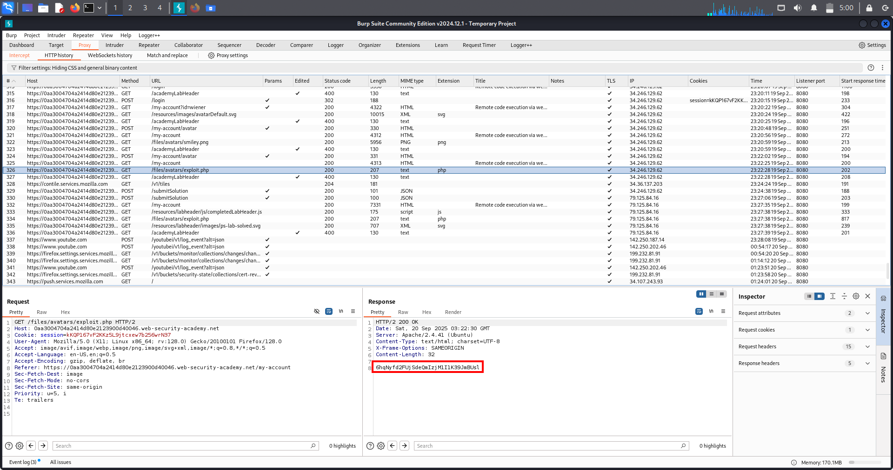

# ✅Lab-1 File Upload Vulnerabilities – Arbitrary File Upload → RCE

---

## 1. Overview

This vulnerability occurs when a web application allows users to upload files without enforcing strict validation on:

- File extension
- MIME type
- File contents
- Execution permissions

As a result, an attacker can upload a **malicious executable file** (such as a PHP script) and trigger it via a web-accessible path, leading to **Remote Code Execution (RCE)**.

---

## 2. What This Topic Is About

File upload vulnerabilities arise when an application assumes uploaded files are safe and does not verify:

- Whether the file is executable
- Whether the upload directory allows code execution
- Whether user-controlled filenames are trusted

The attacker abuses this trust to upload a **server-side script** and execute arbitrary commands or read sensitive files.

---

## 3. Real-World Scenarios

Common real-world appearances of this vulnerability:

✔ Profile image uploads allowing `.php` files  
✔ Attachment upload features in CMS panels  
✔ Support ticket file uploads  
✔ Legacy PHP applications  
✔ Misconfigured web servers allowing execution in `/uploads/`  

Impact often includes:

- Full server compromise
- Credential theft
- Database access
- Pivoting to other internal services

---

## 4. Lab Walkthrough (File Upload → Execution)

### Lab Condition

- Application allows avatar upload
- Uploaded files are stored inside a **web-accessible directory**
- No restriction on executable file extensions

### Goal

Retrieve Carlos’s secret from:

```
/home/carlos/secret
```

### Exploit Used

Uploaded PHP file (`exploit.php`):

```php
<?php
echo file_get_contents('/home/carlos/secret');
?>
```

### Attack Flow

1. Login as low-privileged user
2. Upload `exploit.php` as avatar
3. Application stores file in:

```
/files/avatars/exploit.php
```

4. Browser automatically requests the uploaded file
5. PHP code executes on the server
6. Secret is revealed in the response

✔ Lab solved

---

## 5. Screenshot Proof (Exploit Execution)

The following screenshot shows successful execution of `exploit.php` and retrieval of Carlos’s secret.



---

## 6. High-Value Targets After Upload Execution

Once RCE is achieved, attackers commonly target:

### Sensitive Files

```
/home/carlos/secret
/etc/passwd
/etc/shadow
```

### Application Secrets

```
/var/www/.env
config.php
```

### SSH Keys

```
/home/*/.ssh/id_rsa
```

---

## 7. Multi-Chain Attack Possibilities

A simple file upload flaw can be chained into:

✔ File Upload → Web Shell → Full RCE  
✔ File Upload → Credential Theft → Account Takeover  
✔ File Upload → Database Access → Data Exfiltration  
✔ File Upload → Privilege Escalation  

This makes file upload vulnerabilities **high-impact and critical**.

---

## 8. Remediation (How to Fix)

❌ Insecure Approaches:

- Relying only on file extension checks
- Trusting `Content-Type` headers
- Allowing uploads inside web root

✔ Secure Fixes:

- Allowlist extensions strictly
- Verify file contents (magic bytes)
- Store uploads outside web root
- Disable script execution in upload directories
- Rename uploaded files (random UUIDs)

---

## 9. Extra Notes / Pentester Tips

- Always check if upload paths are web-accessible
- Test execution by requesting the file directly
- Even “image-only” uploads may allow bypass
- Execution can also occur via includes or admin previews

---

> **Final Takeaway:**  
> File upload vulnerabilities are dangerous not because files are uploaded — but because the server later **executes or processes them**.

# File Upload – Lab 2: Web-shell Upload via Content-Type Restriction Bypass

---

## 🔹 Overview
This lab demonstrates an upload restriction bypass where the application attempts to block non-image uploads by checking the multipart file-part *Content-Type* (and possibly filename).  
Because Content-Type and filename are client-controllable, an attacker can spoof these values, upload a PHP web shell, execute it, and read sensitive files (e.g., /home/carlos/secret).

---

## 🔹 Why this matters
- Relying only on client-supplied headers or filename checks is insecure.  
- Upload + execution → *remote code execution (RCE)*, data exfiltration, persistence, and full server compromise.  
- This technique is common in labs and real applications and is often straightforward to exploit.

---

## 🔹 Lab goal (concise)
Bypass upload restrictions, upload a PHP web shell, GET the uploaded file, retrieve /home/carlos/secret, and submit the secret.

---

## 🔹 Methodology / Exact steps

1. *Baseline — discover stored path*
   - Log in (e.g., wiener:peter) with Burp Proxy ON.  
   - Upload a benign image (avatar) and forward the POST.  
   - Open the account page and check Burp → Proxy → HTTP history → filter by Images to find the GET the browser made for the stored image.  
   - Copy the exact stored path (canonical URL) — you will use this later.

2. *Prepare web shell*
   - Create exploit.php locally with a simple payload:
     php
     <?php echo file_get_contents('/home/carlos/secret'); ?>
     

3. *Intercept a fresh upload POST*
   - On the upload UI choose exploit.php and click Upload while Burp intercepts.  
   - Right-click the captured request → *Send to Repeater* (safe place to edit).

4. *Bypass Content-Type / extension checks (edit only the file-part)*
   Try these techniques in order — stop when one works:

   *A — Change the file-part Content-Type*
   Content-Disposition: form-data; name="avatar"; filename="exploit.php" Content-Type: image/jpeg

   <?php echo file_get_contents('/home/carlos/secret'); ?>- Keep CSRF and other form fields
   - Keep CSRF and other form fields unchanged. Forward the request.

*B — Double-extension*
Content-Disposition: form-data; name="avatar"; filename="exploit.php.jpg" Content-Type: image/jpeg 
- Forward and check if uploaded as .php.jpg but executed.
*C — GIF-stub (if magic-bytes checked)*
?php echo file_get_contents('/home/carlos/secret'); ?>
*D — Alternate extensions*
- Try exploit.phtml, exploit.php5, exploit.phar, etc.

5. *Confirm upload & request the shell*
- If the upload response returns a filename, use it. Otherwise re-open the account page and capture the avatar GET — that reveals the final path including any prefix or renaming.  
- Send a clean GET to the stored file URL using the same Host and Cookie: session=... headers:
  
  GET /files/avatars/exploit.php HTTP/1.1
  Host: <lab-host>
  Cookie: session=<session>
  Accept: */*
  Connection: close
  
- The response should include the secret — copy & submit.

6. *If execution fails*
- Try different extensions or double-extensions.  
- If source is returned (no execution), you still gain intelligence; try other upload endpoints or modify the path.  
- If upload blocked due to CSRF, refresh for a new token and re-capture the POST.

---

## 🔹 Proof of Exploit
  
(Screenshot shows the GET to the uploaded shell and the returned /home/carlos/secret output — this single image is the clearest proof of successful exploitation.)

---

## 🔹 Troubleshooting quick checks
- *404 Not Found* → wrong path/prefix or file renamed; use the exact GET captured after benign upload.  
- *Source returned (no exec)* → server doesn’t execute .php in that directory — try .phtml, double-ext, or GIF stub.  
- *Upload blocked / CSRF* → refresh the upload page and capture a fresh POST (new token).  
- *Client-side blocking* → always edit the captured POST in Repeater/Proxy to bypass browser JS checks.

---

## 🔹 Security Impact
- Remote code execution → full server takeover.  
- Exposure of DB credentials, config files, SSH keys → persistent compromise and lateral movement.  
- Web shell access enables data exfiltration and privilege escalation.

---

## 🔹 Remediation & best practices
- Enforce *server-side* validation with an allowlist of safe extensions and MIME types.  
- Validate file contents (magic bytes) in addition to filename checks.  
- Store uploaded files *outside* webroot or serve from a separate non-executable domain/subdomain.  
- Rename uploaded files to safe, non-executable names and remove execute permissions.  
- Implement AV scanning, size limits, and strict ACLs on uploaded content.

---
